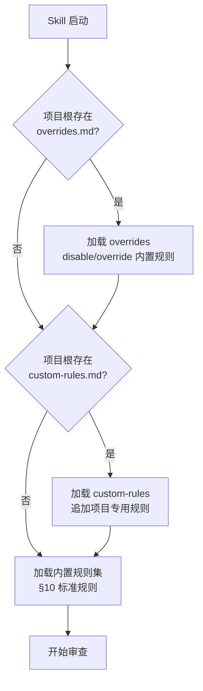
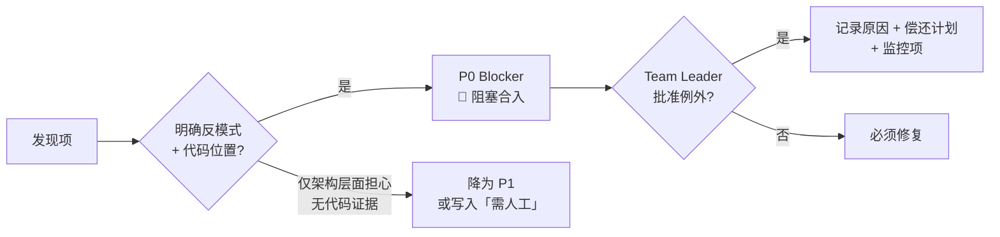
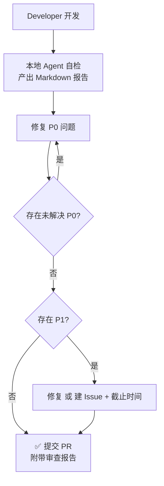
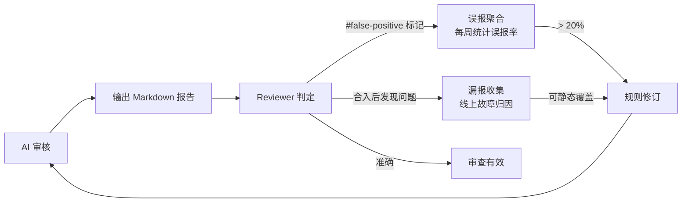

# Android 性能 AI Code Review 技能 PRD

| 属性 | 内容 |
|------|------|
| 文档版本 | v3.0 |
| 创建日期 | 2026-06-03 |
| 状态 | 草案 |
| 适用范围 | Android 客户端（Java/Kotlin），含 View 体系与 Jetpack Compose |
| 关联产物 | Cursor Agent Skill（`android-performance-cr`，待创建） |

---

## 1. 背景与目标

### 1.1 背景

Android 应用在启动速度、流畅度、内存、电量与稳定性上的体验，高度依赖日常迭代中的代码质量。性能问题往往在合入后才发现，修复成本高。需要在 **Code Review（CR）** 阶段建立可执行、可度量的检查规则，并封装为 **AI Agent Skill**，供 Cursor/同类 AI Code Reviewer 在 PR 审查时稳定调用，将性能风险前置拦截。

### 1.2 目标

- 定义一套 **结构化、可勾选** 的 Android 性能 CR 规则，供 AI Code Review 使用。

- 规则按 **严重等级** 与 **检查维度** 分类，便于培训、统计与自动化扩展（Lint、静态分析、AI Review）。

- 每条规则包含：**检查项、反例、正例、判定标准、参考工具**（见第 10 章）。

- 明确 **本地 Agent 触发**、**平台无关的 Markdown 输出**、与 CR 流程衔接，使审查结果可复现、可聚合。

### 1.3 非目标

- 不替代完整的性能测试（Benchmark、Monkey、线上 APM）。

- 不覆盖 iOS/服务端性能规范。

- 不在本阶段实现 Lint 规则代码或 CI 流水线（仅定义规则与路线图）。

### 1.4 成功指标

| 指标 | 目标 | 度量方式 |
|------|------|----------|
| CR 覆盖率 | 性能相关 PR 中 ≥ 80% 附带审查 Markdown 产物 | PR 附件或本地路径中存在 `android-performance-cr-report.md` |
| 问题前置率 | P0 类（主线程违规、明显泄漏）合入前拦截率较基线提升 | 对比合入前后 30 天同类 Issue/ANR 归因 |
| 审查一致性 | 同一 diff 两次 AI 审查，P0/P1 结论一致率 ≥ 70% | 双跑抽样（Phase 3 上线后） |
| 误报可接受度 | Reviewer 标记「不适用」的 P0 建议占比低于 15% | 评论标签 `#false-positive` 统计 |

---

## 2. 用户与使用场景

### 2.1 角色

| 角色 | 职责 |
|------|------|
| AI Code Reviewer | 挂载本 Skill，按规则逐项审查，输出 Blocker/Should Fix/Nice to Have |
| 提交者（Author） | 在 PR 描述中标注改动类型、性能验证方式（满足 OBS-01） |
| Team Leader | 维护规则版本、裁定争议与 P0 例外 |
| 平台/性能组 | 提供工具链、基线数据、规则迭代与 Lint 映射 |

### 2.2 使用场景

| 场景 | 审查侧重 | Hotfix 说明 |
|------|----------|-------------|
| 功能 PR（UI/网络/存储/后台） | 按 §5 映射勾选对应维度 | 可缩减至「必查维度」，**P0 不得跳过** |
| 重构/架构 PR | 启动链、生命周期、线程模型（§10.2、§10.8、§10.1） | 同上 |
| 依赖升级 PR | 包体、启动、主线程（§10.9、§10.2） | 同上 |
| 仅文案/颜色 | §10.3（若动布局）、§10.9（若新增资源） | 流水线仍全量扫描；本地可按 §6 速查缩减 |

---

## 3. AI Skill 产物定义

本 PRD 的规则清单将落地为 Cursor **Agent Skill**。Skill 是审查时的「操作手册」，不是应用代码。

### 3.1 触发方式

审查能力通过 **Skill + Markdown 输出**，由开发者在 IDE 中触发；**不绑定** GitLab、GitHub、Cursor 等特定平台的评论或 API 形态。

| 属性 | 说明 |
|------|------|
| **触发方式** | 开发者在 IDE 中挂载 `/ @android-performance-cr` 本 Skill |
| **扫描范围** | **全量**：§10 全部维度均执行；Author 可声明仅审 §6 速查维度（须在输出中写明「缩减范围」） |
| **典型时机** | push 前、Reviewer 要求补审、离线自检 |

Skill 自检产出供 Author 提前修复使用。

### 3.2 输入

| 输入 | 说明 |
|------|------|
| 代码变更集 | `git diff`、未提交改动、或用户 @ 指定文件/目录 |
| 文字说明 | 用户对话补充、可选本地 `CR_DESCRIPTION.md` |
| 可选上下文 | Lint 报告、模块 README |

### 3.3 输出格式（强制·平台无关）

**唯一交付形态为标准 Markdown 文档**（`.md` 或等价字符串）。禁止依赖某一托管平台的专有字段（如 GitHub Review Comment JSON-only、GitLab Note 扩展字段等）作为唯一载体。

| 约定项 | 说明 |
|--------|------|
| 推荐文件名 | `android-performance-cr-report.md` |
| 编码与结构 | UTF-8；标题层级与下表固定，便于脚本解析 |
| 投递方式 | 本地 Markdown 文件、PR 附件、粘贴进 PR 描述、IM、Wiki；**内容格式不变** |
| 元数据 | 文首 YAML front matter **可选**；无 front matter 时须保留下文「摘要」列表项 |

AI 审查结果须使用以下结构：

```markdown

## Android 性能 CR 摘要

- **改动类型**：（Author 声明 + AI 推断）

- **触发通道**：`local-agent`

- **AI 模型/版本**：（如 GPT-4o-2024-08-06 / Claude-3.5-Sonnet；由调用方注入，用于一致性复盘）

- **扫描范围**：full（§10 全量）| reduced（注明依据 §6 条目）

- **已查维度**：10.1, 10.3, …

- **审查耗时**：（秒；如超时则标注 partial 并注明原因）

- **合入建议**：通过/修复后合入/阻塞（存在未解决 P0）

### 发现项

| 规则 ID | 等级 | 文件:行 | 说明 | 建议 |
|---------|------|---------|------|------|
| MT-01 | P0 | FooActivity.kt:42 | 主线程同步读 SP | 改为 apply/DataStore |

### 未覆盖/需人工

- （如：仅改 ProGuard 规则，无法静态判断启动影响）

### 验证建议（OBS-01）

- （若 PR 未说明，AI 应提示 Author 补充）

```

在 PR 讨论中引用单条发现时，仍建议使用行内格式：`\[MT-01|P0] …`（纯 Markdown 文本，非平台 API）。

### 3.4 Skill 文件结构（待实现）

| 路径 | 内容 |
|------|------|
| `android-performance-cr/SKILL.md` | 触发说明、§3.3 输出模板、§6 映射表、P0 优先 |
| 本 PRD §10 | 规则权威来源；Skill/流水线均引用同一规则集 |

### 3.5 规则加载机制：内置规则 + 外置规则

Skill 采用 **双层规则模型**，兼顾通用性与项目定制：

**内置规则**：Skill 内部预置本 PRD §10 的全部规则（约 40+ 条），开箱即用。

**外置规则**：项目可通过在仓库根路径放置规则文件，在审查时自动合并。Skill 启动时按以下**发现顺序**加载（后加载的同 ID 规则覆盖内置）：

| 优先级 | 路径 | 说明 |
|--------|------|------|
| 1（最高） | `<项目根>/.android-performance-cr/custom-rules.md` | 项目专用规则，覆盖或补充内置规则 |
| 2 | `<项目根>/.android-performance-cr/overrides.md` | 项目级内置规则覆盖（如调整等级、禁用某规则） |
| 3（默认） | Skill 内置规则集 | §10 标准规则，作为兜底 |



**外置规则文件格式**：与 §10 表格同构（Markdown 表格）；每条规则至少包含 `ID | 等级 | 检查项 | 反例 | 正例 | 判定 | 参考工具`。未指定 ID 的规则将被跳过。

**overrides.md 格式**：

```markdown
| 操作 | 规则 ID | 新等级 | 说明 |
|------|--------|--------|------|
| disable | MEM-03 | — | 项目使用统一图片加载框架，自动采样 |
| override | ST-01 | P1 | 启动 SDK 初始化已在基线中计量，P0 过严 |
| add | CUSTOM-01 | P0 | （新增规则，须包含完整七列） |
```

**覆盖行为**：
- `disable`：本次审查忽略该规则，不在报告中出现。
- `override`：改变内置规则等级（P0↔P1↔P2），保留其他属性。
- `add`：追加新规则（须包含完整七列），ID 格式建议 `CUSTOM-NN`。
- **合入门禁仍以通道 A 报告中的 P0 为准**：被 override 降级的 P0 不再阻塞，被 add 或 override 升级的 P0 将阻塞合入。

### 3.6 审查规模建议

| 参数 | 建议值 | 说明 |
|------|--------|------|
| 单文件最大行数 | 2000 行 | 超大文件按方法/类边界分段审查 |

> 审查超时、并发限制、大 PR 降级等 SLA 相关策略已移至 [§13 后期展望](#13-后期展望流水线集成与-ci-自动化)。

> 质量保障与反馈机制（误报反馈、漏报收集、审查校准、一致性度量）已移至 [§13.3 后期展望](#133-质量保障与反馈机制)。

### 3.7 已知限制与盲区

以下问题类型属于静态 diff 审查的 **固有盲区**，AI Code Reviewer 在未配备运行时工具时无法准确检测。Skill 在对应场景下应输出「需人工」或引用对应工具建议，不作为 P0 报告。

| 限制类型 | 说明 | 建议兜底方式 |
|----------|------|-------------|
| Native 内存分配 | JNI 层 `malloc`/`new` 无 GC 管理，无法从 Java/Kotlin 静态代码追踪 | Perfetto Heap Profile、MAT Native 堆分析 |
| JNI 调用耗时 | `native` 方法内部逻辑不可见，无法评估是否有阻塞操作 | Systrace 自定义 Trace Section、Perfetto |
| 反射调用 | 运行时反射的类加载、方法调用开销无法静态预判 | R8 反射规则审查（若可获取） |
| 动态代理 / AOP | 编译期/运行时字节码插桩引入的额外开销不可见 | Gradle 编译扫描、Transform 列表审查 |
| 运行时配置变化 | `onConfigurationChanged` 引起的重建/重组频率依赖设备环境 | 旋转/折叠模拟测试、Compose Layout Inspector |
| 第三方 SDK 内部行为 | SDK 闭源 jar/aar 内部实现无法审查 | SDK 性能文档、接入前 benchmark 基线 |
| 线程调度实际分布 | 协程/线程池的任务调度受设备核心数、负载、温控影响 | Systrace 实际运行轨迹 |
| 硬件相关性能 | GPU 渲染瓶颈、存储介质差异（eMMC vs UFS）、发热降频 | GPU 渲染分析、Battery Historian |
| ProGuard/R8 实际效果 | 保留规则不当导致的包体膨胀需运行时验证 | APK Analyzer 比对、包体对比 |

**处理原则**：AI 遇到上述场景时，不应臆造发现项；应在报告中「未覆盖/需人工」中注明受限类型 + 建议的验证工具，引导 Reviewer 关注。

---

## 4. 规则分级

| 等级 | 代号 | 含义 | CR 行为 |
|------|------|------|---------|
| P0 | Blocker | 高概率导致 ANR、崩溃、严重卡顿或内存失控 | **必须修复**方可合入 |
| P1 | Should Fix | 明显性能劣化或坏味道，短期可接受需跟进 | 本次修复或建 Issue 并约定时间 |
| P2 | Nice to Have | 优化建议、可维护性 | 建议采纳，不阻塞合入 |



**AI 判定原则**：有明确反模式匹配且可指向代码位置 → 按表定级；仅架构层面「可能」变慢且无代码证据 → 降为 P1 或写入「需人工」。

---

## 5. CR 流程



### 5.1 AI Code Reviewer 审查步骤

1. 解析 diff，用 §6 表确定 **必查维度**。

2. 在该维度内 **先 P0 后 P1**，每条发现绑定 `规则 ID` + 文件行号。

3. 无法从静态 diff 判断的项写入「未覆盖/需人工」，不得臆造 P0。

4. 例外合入 P0：须 Team Leader 批准，PR 记录原因、偿还计划、监控项。

5. **报告完整性检查**：产出前确认 `合入建议` 字段与 P0 状态一致。

### 5.2 争议处理

- 规则解释以本文档 §10 为准；歧义由性能组 + Team Leader 裁定。

- 业务强需求无法满足时：降级为 P1 + Issue + 线上监控。

- AI 与人工结论冲突：以人工为准；争议裁定结果须记录（规则 ID、裁定理由、最终等级、裁定人、日期），供后续规则迭代参考（详见 [§13.3](#133-质量保障与反馈机制)）。

---

## 6. 改动类型 → 规则维度速查

按改动类型勾选 **§10** 中对应小节。

| 改动类型 | 必查章节（§10） |
|----------|-----------------|
| 新页面/列表/动画 | 10.1 主线程、10.3 UI、10.4 内存 |
| Application/启动/SDK | 10.2 启动、10.9 包体与依赖 |
| 接口/数据层 | 10.1、10.5 网络、10.6 磁盘 |
| 后台/推送/定时 | 10.7 后台与电量、10.8 线程与协程 |
| 仅文案/颜色 | 10.3（若涉及布局）、10.9（若新增资源） |
| Compose 新屏 | 10.1、10.3（含 10.3.A Compose 专项全部 CP- 规则）、10.4、10.8 |
| 模块依赖/架构变更 | 10.12、10.9、10.2 |
| 跨进程/多进程 | 10.12（ARCH-04）、10.7 |

**合入最低要求**：审查报告内 **零未解决 P0**（按规则 ID 上报，无发现则表为空）；OBS-01 在性能敏感改动时必填。

### 6.1 路径启发式（供 AI 辅助映射）

| 路径/符号特征 | 建议纳入维度 |
|-----------------|--------------|
| `Application`、`ContentProvider`、`Startup` | 10.2 |
| `Activity`/`Fragment`/`Composable` + `onCreate`/`LaunchedEffect` | 10.1、10.2 |
| `RecyclerView`、`Adapter`、`LazyColumn`、`items(` | 10.3（含 10.3.A CP-01 Compose key 检查）、10.4 |
| `@Composable` 函数签名、`@Stable`、`@Immutable`、`LaunchedEffect`、`derivedStateOf` | 10.3.A Compose 专项 |
| `OkHttp`、`Retrofit`、`suspend` 网络层 | 10.5、10.1 |
| `SharedPreferences`、`DataStore`、`Room` | 10.6、10.1 |
| `WorkManager`、`Service`、`AlarmManager` | 10.7 |
| `Dispatchers`、`CoroutineScope`、`Flow` | 10.8 |
| `build.gradle` / `build.gradle.kts`（新依赖、SDK 版本变更、implementation/api project、Dynamic Feature） | 10.9、10.2、10.12（模块化） |
| `proguard-rules.pro` / R8 配置变更 | 10.9（包体与启动效果需补充验证） |
| JNI / `.cpp` / `.c` / `System.loadLibrary` | 10.1（JNI 调用频率）、10.4（Native 内存）、10.8（线程挂载） |
| `WebView` / `WebViewClient` / `@JavascriptInterface` | 10.11 |
| `minSdk` / `targetSdk` / `compileSdk` 变更 | 10.7（后台限制）、10.9（包体策略） |
| AIDL `.aidl`、`ContentProvider`（跨进程）、`SharedMemory`、`SplitInstallManager` | 10.12（多进程通信/Dynamic Feature） |

### 6.2 影响半径启发式（供 AI 审查时扩展维度）

AI 审查时遇到以下「高影响节点」改动，应联动扩展审查维度（即使改动区不在该文件自身）：

| 改动点 | 影响半径 | 连带审查维度 |
|--------|----------|-------------|
| `Application.onCreate` | 全链路启动 | 10.2（全文）、10.1（主线程路径）、10.4（生命周期持有） |
| 核心网络模块（API 基础类、拦截器） | 所有网络调用路径 | 10.5（全量）、10.1（回调线程） |
| `ViewModel` / `Presenter` 基类 | 所有子类页面 | 10.4（泄漏）、10.8（协程 Scope） |
| 自定义 View 基类 | 所有实例 | 10.3（onDraw 分配、布局层级） |
| `build.gradle` 依赖变更 | 全模块 | 10.9、10.2（启动链路）、10.12（若涉及模块依赖关系） |
| `AndroidManifest.xml` 新增组件 | 对应组件链路 | 10.7（Service/BroadcastReceiver）、10.2（Provider） |
| Compose 基础 Composable（Design System 组件） | 所有使用该组件的页面 | 10.3.A（CP-04 Modifier、CP-05 CompositionLocal、CP-06 Lambda 缓存） |
| 跨模块接口/API 基类 | 所有调用方模块 | 10.12（ARCH-01 序列化开销、ARCH-04 Binder 通信） |

---

## 7. 工具速查卡

> AI Skill 在遇到静态审查盲区或规则要求工具验证时，SHALL 引用本节工具条目。每工具提供安装方式、核心命令/操作步骤、关键输出解读。

### 7.1 工具概览

| 场景 | 工具 |
|------|------|
| 主线程 IO/泄漏 | StrictMode、LeakCanary |
| 卡顿/启动 | Android Studio Profiler、Perfetto、Systrace |
| 内存 | Memory Profiler、Heap Dump |
| 电量 | Battery Historian |
| 静态检查 | Android Lint、Detekt 自定义规则 |
| Compose | Layout Inspector（重组）、Macrobenchmark（可选） |

### 7.2 详细速查

| 工具 | 安装/启用方式 | 核心命令/操作 | 关键输出解读 |
|------|-------------|-------------|------------|
| **StrictMode** | 代码内启用，无需额外依赖 | `StrictMode.setThreadPolicy(ThreadPolicy.Builder().detectDiskReads().detectDiskWrites().detectNetwork().penaltyLog().build())`<br>`StrictMode.setVmPolicy(VmPolicy.Builder().detectActivityLeaks().detectLeakedClosableObjects().penaltyLog().build())` | ① Logcat 中 `StrictMode policy violation` 行 → 违规类型（DiskRead/Network/ActivityLeak）+ 完整调用栈<br>② `penaltyDeath()` 模式下触发即崩溃，仅用于 Debug<br>③ 建议在 `Application.onCreate` 中仅在 `BuildConfig.DEBUG` 下启用 |
| **Systrace** | Android SDK Platform Tools 自带<br>Python 2.x 环境（Android 9-） | `python systrace.py -o trace.html gfx view wm am dalvik`（Android 9-）<br>或直接用 **Perfetto**（Android 10+） | ① 主线程轨道：`sleeping/running/runnable` 状态占比，若 `running` > 16ms 连续出现 → 掉帧<br>② `Choreographer#doFrame` 标记：每个 Vsync 周期耗时，超过 16ms/32ms 阈值为卡顿帧<br>③ `Binder` 轨道：跨进程调用耗时 > 5ms 需关注 |
| **Perfetto** | 系统内置（Android 10+），无需安装<br>Web UI：`ui.perfetto.dev` | `adb shell perfetto -o /data/misc/perfetto-traces/trace -t 10s gfx input view wm am`（命令行）<br>或用 `record_android_trace` 脚本（更友好） | ① 在 `ui.perfetto.dev` 打开 trace 文件<br>② `MainThread` 轨道中 `doFrame` 耗时：> 16ms = 掉帧，> 32ms = 明显卡顿<br>③ 搜索 `Choreographer` 事件查看帧回调耗时分布<br>④ 支持 SQL 查询（如 `SELECT * FROM slice WHERE dur > 16000000`） |
| **LeakCanary** | `debugImplementation 'com.squareup.leakcanary:leakcanary-android:2.x'` | 自动触发，无需手动命令<br>Activity/Fragment 销毁后自动检测 | ① 系统通知展示泄漏对象 + 最短引用路径图<br>② 路径中蓝色=强引用、虚线=弱引用<br>③ 点击堆栈跳转到持有者的代码行<br>④ LeakCanary Logcat 输出 `D/LeakCanary: Watching instance of ...` |
| **Memory Profiler** | Android Studio → View → Tool Windows → Profiler | 运行 App → Profiler 窗口 → 点击 Memory 时间线 → 选择区间 → 右键 Export Heap Dump | ① Allocation Count：按类/方法统计对象分配数量<br>② Shallow Size vs Retained Size：Retained Size 反映对象及其引用树的总占用<br>③ 两次 Heap Dump 对比：找出持续增长的对象类型 → 泄漏嫌疑<br>④ `Activity`/`Fragment` 实例数应 ≤ 预期存活的页面数 |
| **Battery Historian** | Docker 或本地安装<br>`docker run -p 9999:9999 gcr.io/android-battery-historian/stable:3.1` | `adb shell dumpsys batterystats --reset`（重置统计）→ 操作 App → `adb bugreport bugreport.zip` → 上传 `localhost:9999` | ① Device Power Estimates：各 App/Uid 耗电占比<br>② WakeLock 表格：持有时间最长的 WakeLock →电量杀手<br>③ JobScheduler 统计：Job 运行频率与持续时间<br>④ Mobile Radio Active 时长：网络长时间保持连接 → 耗电警告 |
| **APK Analyzer** | Android Studio → Build → Analyze APK → 拖入 `.apk` 文件 | 直接拖入 APK 或选择历史构建产物 | ① `classes.dex` 大小 → 方法数估算<br>② `lib/` 下各 ABI `.so` 文件大小 → 检查是否已 strip 符号表<br>③ `res/` 资源占用排名 → 找出未压缩大图<br>④ 前后版本对比：Diff 模式找出膨胀源 |
| **Database Inspector** | Android Studio → View → Tool Windows → App Inspection → Database Inspector | 运行 App → 选择进程 → Database Inspector 自动加载 Room/SQLite 数据库 | ① 实时查询（Live Query）：执行 SQL 观察耗时<br>② 表结构：索引是否存在、字段类型是否匹配<br>③ 数据量：大表行数统计，评估是否需要分页 |
| **Network Profiler** | Android Studio → View → Tool Windows → Profiler → Network | 运行 App → 操作触发网络请求 → 查看时间线 | ① Request Timeline：各请求排队+发送+等待+响应时间<br>② Connection View：连接复用情况（HTTP/2 多路复用是否生效）<br>③ Response Size：单个响应体大小，大 JSON 需分页或字段裁剪 |
| **Compose Layout Inspector** | ... | ... | ... |
| **Compose Compiler Metrics** | `build.gradle.kts` 中启用 `composeCompiler { reportsDestination = layout.buildDirectory.dir(\"compose_compiler\") }` | `./gradlew assembleRelease` → 查看 `build/compose_compiler/<module>_classes.txt` | ① `unstable` 标记的参数 → 需 @Stable 注解<br>② `restartable but not skippable` → 添加 stable 参数后可跳过<br>③ 每个 Composable 的 `restart`/`skip` 统计 → 优化重组目标 |

---

## 8. 附录

### 8.1 术语

| 术语 | 说明 |
|------|------|
| TTID | Time To Initial Display，首帧显示 |
| TTFD | Time To Full Display，首屏内容完整 |
| ANR | Application Not Responding |
| Jank | 掉帧、卡顿 |

### 8.2 业务自定义指标（待填写）

| 业务线 | 冷启动 P50 目标 | 列表滑动 FPS | 其他 |
|--------|----------------|--------------|------|
| \_\_\_ | \_\_\_ ms | ≥ \_\_\_ | \_\_\_ |

### 8.3 修订记录

| 版本 | 日期 | 修订人 | 说明 |
|------|------|--------|------|
| v1.0 | 2026-06-03 | — | 初版：10 维度、40+ 检查项 |
| v1.1 | 2026-06-03 | — | 补充 Skill 定义、流程图、章节引用修正、成功指标度量、输出模板、路径映射 |
| v1.2 | 2026-06-03 | — | 平台无关 Markdown 输出；双触发（流水线全量/本地 Agent） |
| v1.3 | 2026-06-03 | — | 补充遗漏规则、外部规则机制、SLA、质量反馈闭环、影响半径、已知限制 |
| v2.0 | 2026-06-03 | — | 全面覆盖：§11 兜底规则转正、Compose 专项、§10.12 架构、§7.4 工具速查卡、真实案例；规则总数 64→81 |
| v3.0 | 2026-06-03 | — | 激进清理流水线至 §13；81 条规则全部补全可编译 Kotlin 反例/正例；新增 Compose Compiler Metrics 条目 |

> Skill 已知限制（静态审查盲区）详见 [§3.7 已知限制与盲区](#37-已知限制与盲区)。

---

> 已决项已体现在正文中；待排期与讨论中事项已移至 [§13.4 待决策开放项](#134-待决策开放项)。

---


## 10. 规则清单（按维度）

> 说明：**IO-01** 与 **MT-01** 主线程磁盘 IO 重叠；IO-01 强调存储介质与体量，命中时任一报告即可。**参考工具** 列供 AI 在建议中引用，非每条都必须跑工具。

### 10.1 主线程与 ANR（P0 高发区）

| ID | 等级 | 检查项 | 反例 | 正例 | 判定 | 参考工具 |
|----|------|--------|------|------|------|----------|
| MT-01 | P0 | UI 线程禁止同步磁盘 IO | ```kotlin\n// ❌ 主线程同步读 SP → ANR\nval sp = getSharedPreferences(\"app\", MODE_PRIVATE)\nval value = sp.getString(\"key\", \"\") // 主线程阻塞\nsp.edit().putString(\"key\", \"data\").commit() // 同步写\n``` | ```kotlin\n// ✅ 后台线程 + DataStore\nviewModelScope.launch(Dispatchers.IO) {\n    val value = dataStore.data.first()[stringPreferencesKey(\"key\")]\n    withContext(Dispatchers.Main) { updateUI(value) }\n}\n// ✅ SP 异步写\nsp.edit().putString(\"key\", \"data\").apply()\n``` | 主线程栈出现阻塞 IO | StrictMode、Systrace |
| MT-02 | P0 | UI 线程禁止同步网络 | ```kotlin\n// ❌ OkHttp 同步 → ANR\nval client = OkHttpClient()\nval resp = client.newCall(request).execute() // 阻塞主线程\n``` | ```kotlin\n// ✅ Retrofit suspend + IO Dispatcher\nviewModelScope.launch(Dispatchers.IO) {\n    val data = apiService.fetchData()\n    withContext(Dispatchers.Main) { updateUI(data) }\n}\n``` | 网络调用在主线程 | StrictMode、Lint |
| MT-03 | P0 | 禁止主线程大计算 | ```kotlin\n// ❌ 主线程解析大 JSON\nval json = File(\"cache/large.json\").readText()\nval obj = Gson().fromJson(json, BigData::class.java)\n``` | ```kotlin\n// ✅ 后台线程解析\nviewModelScope.launch(Dispatchers.Default) {\n    val obj = Gson().fromJson(json, BigData::class.java)\n    withContext(Dispatchers.Main) { display(obj) }\n}\n``` | 单次主线程占用明显可感知 | Systrace |
| MT-04 | P0 | BroadcastReceiver 内长任务 | ```kotlin\n// ❌ onReceive 中直接做 IO\nclass MyReceiver : BroadcastReceiver() {\n    override fun onReceive(ctx: Context, intent: Intent) {\n        val data = fetchFromNetwork() // ANR!\n    }\n}\n``` | ```kotlin\n// ✅ goAsync + 后台线程\nclass MyReceiver : BroadcastReceiver() {\n    override fun onReceive(ctx: Context, intent: Intent) {\n        val pending = goAsync()\n        thread {\n            val data = fetchFromNetwork()\n            pending.finish()\n        }\n    }\n}\n``` | 10s 内无法完成 | — |
| MT-05 | P1 | 避免主线程锁等待 | ```kotlin\n// ❌ 主线程等待后台持有的锁\nval lock = Object()\nsynchronized(lock) {\n    while (!ready) lock.wait() // UI 冻结\n}\n``` | ```kotlin\n// ✅ 无锁结构 / CAS\nval state = AtomicReference<State>(State.LOADING)\nlifecycleScope.launch {\n    stateFlow.collect { updateUI(it) }\n}\n``` | Systrace 见主线程阻塞 | Systrace |
| MT-06 | P0 | WebView/JS Bridge 禁止主线程重操作 | ```kotlin\n// ❌ 主线程阻塞等待 WebView\nwebView.loadUrl(\"https://example.com\")\nval result = webView.evaluateJavascript(js) { } // 同步等待\n``` | ```kotlin\n// ✅ 异步处理 + 回调\nwebView.evaluateJavascript(js) { result ->\n    lifecycleScope.launch(Dispatchers.Main) {\n        handleResult(result)\n    }\n}\n``` | 主线程调用 WebView API 且有同步等待语义 | Systrace |
| MT-07 | P1 | 主线程避免调用系统服务重操作 | ```kotlin\n// ❌ 主线程查询 PackageManager\nval pm = context.packageManager\nval apps = pm.getInstalledApplications(0) // 耗时 > 50ms\n``` | ```kotlin\n// ✅ 后台获取 + 缓存\nviewModelScope.launch(Dispatchers.IO) {\n    val apps = pm.getInstalledApplications(0)\n    appCache = apps\n}\n``` | 主线程调用系统服务耗时 > 5ms | Systrace |

---

### 10.2 启动与初始化

| ID | 等级 | 检查项 | 反例 | 正例 | 判定 | 参考工具 |
|----|------|--------|------|------|------|----------|
| ST-01 | P0 | Application 中禁止非必要同步重初始化 | ```kotlin\n// ❌ Application 同步初始化所有 SDK\nclass MyApp : Application() {\n    override fun onCreate() {\n        super.onCreate()\n        Firebase.initializeApp(this)\n        Analytics.init(this)\n        ImageLoader.init(this)  // 阻塞数百 ms\n    }\n}\n``` | ```kotlin\n// ✅ 延迟 + Startup 库\nclass MyApp : Application() {\n    override fun onCreate() {\n        super.onCreate()\n        // 仅初始化必需项，其他延迟到空闲或首次使用\n        Looper.myQueue().addIdleHandler {\n            FireAndForget.init()\n            false\n        }\n    }\n}\n``` | 冷启动主线程耗时骤增 | Macrobenchmark、Systrace |
| ST-02 | P1 | ContentProvider 滥用初始化 | ```kotlin\n// ❌ 每个 SDK 单独一个 Provider 自动拉起\nclass SdkAProvider : ContentProvider() {\n    override fun onCreate(): Boolean {\n        SdkA.init(context!!) // 启动时自动执行\n        return true\n    }\n}\n``` | ```kotlin\n// ✅ 合并或使用 Startup\nclass AppInitializer : Initializer<Unit> {\n    override fun create(context: Context) {\n        // 集中初始化，可控顺序\n    }\n}\n``` | 启动前多余进程工作 | App Startup 指南 |
| ST-03 | P1 | 首屏避免阻塞绘制 | ```kotlin\n// ❌ onCreate 同步加载后 setContent\noverride fun onCreate(savedInstanceState: Bundle?) {\n    val data = apiService.fetchHome() // 同线程阻塞\n    setContent { HomeScreen(data) }\n}\n``` | ```kotlin\n// ✅ 骨架屏 + 异步\noverride fun onCreate(savedInstanceState: Bundle?) {\n    setContent {\n        var data by remember { mutableStateOf<HomeData?>(null) }\n        if (data == null) ShimmerScreen() else HomeScreen(data!!)\n    }\n    lifecycleScope.launch { data = apiService.fetchHome() }\n}\n``` | TTFD 变差 | Profiler |
| ST-04 | P2 | 启动任务可度量 | ```kotlin\n// ❌ 无埋点\noverride fun onCreate() { init1(); init2(); init3() }\n``` | ```kotlin\n// ✅ 分阶段打点\nval startTime = SystemClock.elapsedRealtime()\ninitSdk()\nval sdkDone = SystemClock.elapsedRealtime()\nreportTrace(\"app_start\", startTime, sdkDone)\nreportFullyDrawn() // Android 上报首屏完整\n``` | 无法回归对比 | 内部埋点规范 |
| ST-05 | P1 | ContentProvider.onCreate 禁止同步重初始化 | ```kotlin\n// ❌ Provider.onCreate 同步网络预热\nclass MyProvider : ContentProvider() {\n    override fun onCreate(): Boolean {\n        val config = httpGet(\"https://api/config\") // 阻塞\n        return true\n    }\n}\n``` | ```kotlin\n// ✅ 异步初始化 + 标记\nclass MyProvider : ContentProvider() {\n    override fun onCreate(): Boolean {\n        CoroutineScope(Dispatchers.IO).launch {\n            config = prefetch()\n            isReady = true\n        }\n        return true\n    }\n}\n``` | 冷启动 provider 耗时 > 50ms | Systrace |
| ST-06 | P1 | 避免 Application 静态字段初始化重对象 | ```kotlin\n// ❌ companion object 中 lazy 但首次访问仍在主线程\nclass MyApp : Application() {\n    companion object {\n        val gson by lazy { GsonBuilder().create() } // 主线程首次触发\n    }\n}\n``` | ```kotlin\n// ✅ IdleHandler 预加载\nLooper.myQueue().addIdleHandler {\n    backgroundThread { HeavyObject.init() }\n    false\n}\n``` | 首次使用卡顿明显 | Systrace |
| ST-07 | P1 | 启动路径改动需检查 Baseline Profile | ```kotlin\n// ❌ 关键路径改动无 baseline-prof.txt\nfun navigateToHome() {\n    startActivity(Intent(this, HomeActivity::class.java))\n}\n// src/main/baseline-prof.txt 缺失\n``` | ```kotlin\n// ✅ Macrobenchmark 生成 profile\n// app/src/main/baseline-prof.txt\nHSPLandroidx/compose/runtime/ComposerImpl;->apply\nPLkotlin/collections/CollectionsKt___CollectionsKt\n``` | 冷启动时间无 AOT 优化 | Macrobenchmark |

---

### 10.3 UI 渲染与流畅度

| ID | 等级 | 检查项 | 反例 | 正例 | 判定 | 参考工具 |
|----|------|--------|------|------|------|----------|
| UI-01 | P0 | 列表必须使用 ViewHolder/等价复用 | ```kotlin\n// ❌ Adapter 每项 new View\nclass BadAdapter : RecyclerView.Adapter<BadAdapter.VH>() {\n    override fun onCreateViewHolder(parent: ViewGroup, viewType: Int) =\n        VH(LayoutInflater.from(parent.context).inflate(R.layout.item, parent, false))\n    override fun onBindViewHolder(vh: VH, pos: Int) { /* 每次 bind new View */ }\n}\n``` | ```kotlin\n// ✅ ViewHolder 复用\nclass GoodAdapter : RecyclerView.Adapter<GoodAdapter.VH>() {\n    class VH(val binding: ItemBinding) : RecyclerView.ViewHolder(binding.root)\n    override fun onCreateViewHolder(parent: ViewGroup, viewType: Int) =\n        VH(ItemBinding.inflate(LayoutInflater.from(parent.context), parent, false))\n}\n``` | 滑动掉帧、内存涨 | Layout Inspector |
| UI-02 | P1 | 减少布局层级与过度绘制 | ```kotlin\n// ❌ 深层 LinearLayout 嵌套\n<LinearLayout><LinearLayout><LinearLayout><TextView /></LinearLayout></LinearLayout></LinearLayout>\n``` | ```kotlin\n// ✅ ConstraintLayout 扁平化\n<ConstraintLayout>\n    <TextView app:layout_constraintTop_toTopOf=\"parent\" />\n</ConstraintLayout>\n``` | Layout Inspector 层级 > 10 | Layout Inspector |
| UI-03 | P1 | 自定义 View onDraw 禁止分配对象 | ```kotlin\n// ❌ onDraw 里 new Paint\nclass BadView : View {\n    override fun onDraw(canvas: Canvas) {\n        canvas.drawText(\"hello\", 0f, 0f, Paint()) // 每帧 new\n    }\n}\n``` | ```kotlin\n// ✅ 成员变量复用\nclass GoodView : View {\n    private val paint = Paint()\n    override fun onDraw(canvas: Canvas) {\n        canvas.drawText(\"hello\", 0f, 0f, paint)\n    }\n}\n``` | 滑动时 GC 频繁 | Systrace |
| UI-04 | P1 | 避免频繁 invalidate/requestLayout | ```kotlin\n// ❌ 动画每帧全屏 invalidate\noverride fun onAnimationUpdate(animator: ValueAnimator) {\n    invalidate() // 全屏重绘\n}\n``` | ```kotlin\n// ✅ 局部刷新\noverride fun onAnimationUpdate(animator: ValueAnimator) {\n    invalidate(animator.bounds) // 仅脏区\n}\n``` | Systrace 见 excessive draw | Systrace |
| UI-05 | P1 | Compose：缩小重组范围 | ```kotlin\n// ❌ 大 Composable 全树重组\n@Composable\nfun Screen(data: Data) {\n    Column {\n        Header(data.title)\n        Body(data.content) // Header 不需要 recompose 但也被重绘\n    }\n}\n``` | ```kotlin\n// ✅ 拆分 + @Stable\n@Composable\nfun Screen(data: Data) {\n    Column {\n        Header(title = data.title) // title 不变则不重组\n        Body(content = data.content)\n    }\n}\n``` | 重组范围过大 | Layout Inspector |
| UI-06 | P2 | 动画与硬件加速 | ```kotlin\n// ❌ 软件层动画\nview.setLayerType(View.LAYER_TYPE_SOFTWARE, null)\nObjectAnimator.ofFloat(view, \"alpha\", 1f, 0f).start()\n``` | ```kotlin\n// ✅ 硬件层 + clipChildren 优化\nview.clipChildren = true\nview.setLayerType(View.LAYER_TYPE_HARDWARE, null)\n``` | GPU 过载或掉帧 | GPU 渲染分析 |
| UI-07 | P1 | Compose：remember 须带稳定 key | ```kotlin\n// ❌ 无 key\n@Composable\nfun ItemView(item: Item) {\n    val heavy = remember { computeHeavy(item) } // item 变了也不重新算\n}\n``` | ```kotlin\n// ✅ 带 key\n@Composable\nfun ItemView(item: Item) {\n    val heavy = remember(item.id) { computeHeavy(item) }\n}\n``` | 重组触发重复重计算 | Layout Inspector |
| UI-08 | P1 | RecyclerView 条目变更动画避免全量刷新 | ```kotlin\n// ❌ notifyDataSetChanged 全局重绑\nadapter.notifyDataSetChanged()\n``` | ```kotlin\n// ✅ 精确通知\nadapter.notifyItemChanged(position)\nadapter.notifyItemRangeInserted(start, count)\n``` | 列表更新时掉帧 | Systrace |
| UI-09 | P1 | RecyclerView 大列表使用 DiffUtil 差分更新 | ```kotlin\n// ❌ adapter.notifyDataSetChanged() 无动画+全局刷新\n``` | ```kotlin\n// ✅ ListAdapter + DiffUtil\nclass MyAdapter : ListAdapter<Item, VH>(ItemDiffCallback()) {\n    class ItemDiffCallback : DiffUtil.ItemCallback<Item>() {\n        override fun areItemsTheSame(old: Item, new: Item) = old.id == new.id\n        override fun areContentsTheSame(old: Item, new: Item) = old == new\n    }\n}\n``` | 列表更新时掉帧 | Systrace |

#### 10.3.A Compose 专项

> Compose 规则使用独立 `CP-` 前缀，与 View 体系 UI 通用规则区分。AI 审查时通过 `@Composable` / `Composable` 关键字激活此子维度。

| ID | 等级 | 检查项 | 反例 | 正例 | 判定 | 参考工具 |
|----|------|--------|------|------|------|----------|
| CP-01 | P1 | LazyColumn/LazyRow key 必须稳定唯一 | ```kotlin\n// ❌ 用 index 做隐式 key\nLazyColumn { items(list) { Text(it.name) } } // 增删时全量重组\n``` | ```kotlin\n// ✅ 稳定唯一 key\nLazyColumn { items(list, key = { it.id }) { Text(it.name) } }\n``` | key 不唯一导致 Diff 低效 | Compose Layout Inspector |
| CP-02 | P1 | 数据类标注 @Stable / @Immutable 注解 | ```kotlin\n// ❌ 未标注，Compose 认为不稳定\ndata class User(val name: String)\n``` | ```kotlin\n// ✅ 声明稳定性契约\n@Immutable data class User(val name: String)\n``` | 数据类被频繁重组 | Compose Compiler Metrics |
| CP-03 | P1 | LaunchedEffect key 必须稳定且与内部依赖一致 | ```kotlin\n// ❌ key 不随 userId 变\nLaunchedEffect(Unit) { loadData(userId) } // 不会重启\n``` | ```kotlin\n// ✅ key 与内部使用变量一致\nLaunchedEffect(userId) { loadData(userId) }\n``` | 协程未重启或每次重组都重启 | Compose Layout Inspector |
| CP-04 | P1 | 频繁变化的状态用 lambda 版 Modifier | ```kotlin\n// ❌ 组合阶段读滚动状态\nModifier.offset(scrollState.value.dp)\n``` | ```kotlin\n// ✅ 延迟到布局阶段\nModifier.offset { IntOffset(0, scrollState.value) }\n``` | Systrace 显示频繁重组帧 | Systrace |
| CP-05 | P1 | CompositionLocal 提供范围限制在最小子树 | ```kotlin\n// ❌ 全屏提供\nCompositionLocalProvider(LocalX provides val) {\n    EntireScreen() // 全树重组\n}\n``` | ```kotlin\n// ✅ 限制到需要的子树\nColumn {\n    CompositionLocalProvider(LocalX provides val) {\n        ChildComposable()\n    }\n}\n``` | CompositionLocal 变更时重组范围过大 | Compose Layout Inspector |
| CP-06 | P1 | Composable lambda 参数使用 remember 缓存 | ```kotlin\n// ❌ 每次重组分配新 lambda\nButton(onClick = { doSomething(item) }) { Text(\"Go\") }\n``` | ```kotlin\n// ✅ remember 缓存 lambda\nval onClick = remember(item) { { doSomething(item) } }\nButton(onClick = onClick) { Text(\"Go\") }\n``` | 子组件因 lambda 引用变化频繁重组 | Compose Compiler Metrics |
| CP-07 | P2 | 避免在频繁重组区域使用 SubcomposeLayout | ```kotlin\n// ❌ LazyColumn 中 SubcomposeLayout\nLazyColumn {\n    item { SubcomposeLayout { ... } } // 每项触发子组合\n}\n``` | ```kotlin\n// ✅ 用标准布局替代\nLazyColumn {\n    item { Column { ... } }\n}\n``` | 每次重组触发子组合 | Compose Layout Inspector |
| CP-08 | P1 | 派生状态使用 derivedStateOf 而非直接计算 | ```kotlin\n// ❌ 直接 filter 计算\n@Composable fun List(items: List<Item>) {\n    val active = items.filter { it.active } // 每次重组全算\n}\n``` | ```kotlin\n// ✅ derivedStateOf\n@Composable fun List(items: List<Item>) {\n    val active by remember { derivedStateOf { items.filter { it.active } } }\n}\n``` | 基于 State 的计算触发多余重组 | Compose Layout Inspector |

---

### 10.4 内存

| ID | 等级 | 检查项 | 反例 | 正例 | 判定 | 参考工具 |
|----|------|--------|------|------|------|----------|
| MEM-01 | P0 | 禁止 Activity/Context 泄漏 | ```kotlin\n// ❌ 静态持有 Activity\ncompanion object { var activity: Activity? = null }\nfun onCreate() { activity = this }\n``` | ```kotlin\n// ✅ WeakReference\nprivate var activityRef: WeakReference<Activity>? = null\noverride fun onDestroy() { activityRef?.clear() }\n``` | LeakCanary 可复现 | LeakCanary |
| MEM-02 | P0 | 监听/订阅/协程必须随生命周期取消 | ```kotlin\n// ❌ GlobalScope 泄漏\nfun loadData() {\n    GlobalScope.launch {\n        val data = networkCall()\n        textView.text = data // Activity 销毁后 crash\n    }\n}\n``` | ```kotlin\n// ✅ lifecycleScope 自动管理\nlifecycleScope.launch {\n    val data = networkCall()\n    textView.text = data\n} // Activity destroy 时自动 cancel\n``` | 退出页面后仍回调 | LeakCanary、Lint |
| MEM-03 | P1 | 大图按采样加载 | ```kotlin\n// ❌ 原图解码 → OOM\nval bm = BitmapFactory.decodeFile(\"/sdcard/img.jpg\")\nimageView.setImageBitmap(bm)\n``` | ```kotlin\n// ✅ 降采样\nval opts = BitmapFactory.Options().apply {\n    inJustDecodeBounds = true\n    decodeFile(path, this)\n    inSampleSize = calculateScale(outWidth, outHeight, 300, 300)\n    inJustDecodeBounds = false\n}\nval bm = BitmapFactory.decodeFile(path, opts)\n``` | OOM 或内存峰值异常 | Memory Profiler |
| MEM-04 | P1 | 缓存必须有界 | ```kotlin\n// ❌ 无界 HashMap\nprivate val cache = HashMap<String, Bitmap>()\n``` | ```kotlin\n// ✅ LruCache\nval cache = LruCache<String, Bitmap>(4 * 1024 * 1024) { value -> value.byteCount }\n``` | 长时间后内存单调涨 | Memory Profiler |
| MEM-05 | P1 | 及时释放大对象与 Native 资源 | ```kotlin\n// ❌ 未 recycle/close\nvar bitmap: Bitmap? = loadBitmap()\ncursor.moveToFirst() // 未 close\n``` | ```kotlin\n// ✅ use/try-finally\ncursor.use { while (it.moveToNext()) { process(it) } }\nbitmap?.let { if (!it.isRecycled) it.recycle() }\n``` | 内存 Profiler 残留 | Memory Profiler |
| MEM-06 | P0 | 禁止 Handler / 匿名内部类持有 Activity | ```kotlin\n// ❌ 匿名 Handler 持有 Activity\nclass MyActivity : Activity() {\n    val handler = Handler { msg -> textView.text = \"\" }\n}\n``` | ```kotlin\n// ✅ 静态内部类 + WeakReference\nclass SafeHandler(activity: MyActivity) : Handler(Looper.getMainLooper()) {\n    private val ref = WeakReference(activity)\n    override fun handleMessage(msg: Message) {\n        ref.get()?.handle(msg)\n    }\n}\n``` | 退出 Activity 后仍可回调 | LeakCanary |
| MEM-07 | P1 | WebView 建议独立进程 | ```kotlin\n// ❌ WebView 与主进程共用\n<activity android:name=\".WebViewActivity\" />\n``` | ```kotlin\n// ✅ 独立进程\n<activity android:name=\".WebViewActivity\" android:process=\":webview\" />\noverride fun onDestroy() {\n    webView.stopLoading()\n    webView.loadUrl(\"about:blank\")\n    webView.destroy()\n}\n``` | WebView 内存持续增长 | Memory Profiler |
| MEM-08 | P1 | 大图按需降采样，优先硬件位图 | ```kotlin\n// ❌ ARGB_8888 全分辨率\nval bm = BitmapFactory.decodeStream(input)\n``` | ```kotlin\n// ✅ 硬件位图 (Android O+)\nval opts = BitmapFactory.Options().apply {\n    inPreferredConfig = Bitmap.Config.HARDWARE\n}\nval bm = BitmapFactory.decodeStream(input, null, opts)\n``` | 内存峰值、OOM | Memory Profiler |

---

### 10.5 网络

| ID | 等级 | 检查项 | 反例 | 正例 | 判定 | 参考工具 |
|----|------|--------|------|------|------|----------|
| NET-01 | P1 | 避免重复请求与惊群 | ```kotlin\n// ❌ 每次 bind 请求同一接口\noverride fun onBindViewHolder(holder: VH, pos: Int) {\n    api.fetchUser(item.id).execute()\n}\n``` | ```kotlin\n// ✅ 请求去重/缓存\nprivate val inFlight = ConcurrentHashMap<String, Deferred<User>>()\nsuspend fun fetch(id: String) = inFlight.getOrPut(id) {\n    coroutineScope { async { api.fetchUser(id) } }\n}\n``` | 流量与耗电异常 | Network Profiler |
| NET-02 | P1 | 响应体与解析可控 | ```kotlin\n// ❌ 一次拉全部\n@GET(\"users\") suspend fun getAllUsers(): List<User>\n``` | ```kotlin\n// ✅ 分页 + 字段限制\n@GET(\"users\") suspend fun getUsers(\n    @Query(\"page\") page: Int,\n    @Query(\"fields\") fields: String\n): Page<User>\n``` | 解析阻塞后台过久 | — |
| NET-03 | P2 | 弱网与超时策略 | ```kotlin\n// ❌ 无超时\nval client = OkHttpClient()\n``` | ```kotlin\n// ✅ 超时 + 退避\nval client = OkHttpClient.Builder()\n    .connectTimeout(10, TimeUnit.SECONDS)\n    .readTimeout(30, TimeUnit.SECONDS).build()\n``` | 用户长期白屏 | Network Profiler |
| NET-04 | P2 | 连接复用与协议 | ```kotlin\n// ❌ 每次 new client\nfun req() { OkHttpClient().newCall(rq).execute() }\n``` | ```kotlin\n// ✅ 单例复用\nobject HttpClient { val client = OkHttpClient() }\n``` | 连接建立开销大 | Network Profiler |
| NET-05 | P1 | 图片加载必须有磁盘缓存 | ```kotlin\n// ❌ 禁用磁盘缓存\nGlide.with(ctx).load(url).diskCacheStrategy(NONE).into(iv)\n``` | ```kotlin\n// ✅ 默认缓存\nGlide.with(ctx).load(url).into(iv)\n``` | 重复流量 | — |
| NET-06 | P2 | 计量网络检测与流量控制 | ```kotlin\n// ❌ 无网络类型检测\nfun sync() { api.syncAll() }\n``` | ```kotlin\n// ✅ 检测计量网络\nval cm = ctx.getSystemService<ConnectivityManager>()\nif (cm.isActiveNetworkMetered) syncEssential() else syncAll()\n``` | 用户流量超额 | — |

---


### 10.6 磁盘与 I/O

| ID | 等级 | 检查项 | 反例 | 正例 | 判定 | 参考工具 |
|----|------|--------|------|------|------|----------|
| IO-01 | P0 | 主线程禁止同步读大 SP/文件 | ```kotlin\n// ❌ 主线程 readText\noverride fun onCreate(savedInstanceState: Bundle?) {\n    val json = File(cacheDir, \"big.json\").readText()\n}\n``` | ```kotlin\n// ✅ 后台读\nlifecycleScope.launch(Dispatchers.IO) {\n    val json = File(cacheDir, \"big.json\").readText()\n    withContext(Dispatchers.Main) { show(json) }\n}\n``` | 同 MT-01 | StrictMode |
| IO-02 | P1 | 数据库批量与索引 | ```kotlin\n// ❌ 循环单条 insert\nusers.forEach { dao.insert(it) }\n``` | ```kotlin\n// ✅ 事务批量\n@Transaction suspend fun insertAll(users: List<User>) { dao.insertAll(users) }\n// Room DAO: @Entity(indices = [Index(\"name\")])\n``` | 后台耗时过长 | Database Inspector |
| IO-03 | P1 | 日志与埋点异步 | ```kotlin\n// ❌ 主线程同步写\nFile(\"log.txt\").appendText(\"event\\n\")\n``` | ```kotlin\n// ✅ 异步 Channel\nscope.launch(Dispatchers.IO) { logChannel.consumeEach { file.appendText(it) } }\n``` | IO 影响流畅度 | — |
| IO-04 | P2 | 避免频繁小文件读写 | ```kotlin\n// ❌ 每次写完整文件\nfun save(token: String) { File(filesDir, \"t.txt\").writeText(token) }\n``` | ```kotlin\n// ✅ 批量存储\nfun save(token: String) { sp.edit().putString(\"token\", token).apply() }\n``` | I/O 次数过多 | — |
| IO-05 | P1 | SharedPreferences 避免同步 commit | ```kotlin\n// ❌ commit 同步\nsp.edit().putString(\"k\", \"v\").commit()\n``` | ```kotlin\n// ✅ apply 异步\nsp.edit().putString(\"k\", \"v\").apply()\n// 或迁移 DataStore\n``` | 主线程 commit ANR | StrictMode |

---

### 10.7 后台、电量与系统合规

| ID | 等级 | 检查项 | 反例 | 正例 | 判定 | 参考工具 |
|----|------|--------|------|------|------|----------|
| BG-01 | P0 | 后台任务使用合规 API | ```kotlin\n// ❌ 滥用隐式广播 + 常驻服务\nclass MyReceiver : BroadcastReceiver() { ... }\n// Manifest: <receiver android:exported=\"true\"> <intent-filter> <action android:name=\"android.intent.action.TIME_TICK\"/>\n``` | ```kotlin\n// ✅ WorkManager\nval request = PeriodicWorkRequestBuilder<SyncWorker>(15, TimeUnit.MINUTES).build()\nWorkManager.getInstance(ctx).enqueue(request)\n``` | 系统杀进程 | 官方后台限制文档 |
| BG-02 | P1 | WakeLock/定位/传感器及时释放 | ```kotlin\n// ❌ 长时间持有 WakeLock\nval wl = pm.newWakeLock(PARTIAL_WAKE_LOCK, \"tag\")\nwl.acquire(10 * 60 * 1000) // 10 分钟!\n``` | ```kotlin\n// ✅ 用完即释放\nwl.acquire(30 * 1000)\ntry { doWork() } finally { wl.release() }\n``` | Battery Historian 异常 | Battery Historian |
| BG-03 | P1 | 精确定时与轮询 | ```kotlin\n// ❌ 高频 Alarm\nval alarm = AlarmManager()\nalarm.setRepeating(RTC, 0, 60 * 1000, pendingIntent)\n``` | ```kotlin\n// ✅ JobScheduler 约束\nval builder = JobInfo.Builder(1, ComponentName(ctx, Job::class.java))\n    .setMinimumLatency(15 * 60 * 1000)\n    .setRequiredNetworkType(NETWORK_TYPE_UNMETERED)\n``` | 待机耗电高 | Battery Historian |
| BG-04 | P2 | 推送与拉取策略 | ```kotlin\n// ❌ 无条件全量拉\nfun onMessage(msg: RemoteMessage) { syncAll() }\n``` | ```kotlin\n// ✅ 增量 + Doze 兼容\nfun onMessage(msg: RemoteMessage) { syncDelta(msg.since) }\n``` | 后台流量大 | — |
| BG-05 | P0 | Android 14+ 前台服务须声明类型 | ```kotlin\n// ❌ 未声明 foregroundServiceType\nstartForeground(NOTIFICATION_ID, notification)\n``` | ```kotlin\n// ✅ Manifest 声明\n<service android:foregroundServiceType=\"dataSync|location\" />\nstartForeground(NOTIFICATION_ID, notification, FOREGROUND_SERVICE_TYPE_DATA_SYNC)\n``` | 系统拒绝启动 | 官方前台服务文档 |
| BG-06 | P1 | 精确闹钟权限适配（Android 12+） | ```kotlin\n// ❌ 无权限检查\nalarmMgr.setExactAlarm(RTC_WAKEUP, time, pi)\n``` | ```kotlin\n// ✅ 前置检查\nif (alarmMgr.canScheduleExactAlarms()) {\n    alarmMgr.setExactAlarm(RTC_WAKEUP, time, pi)\n} else {\n    alarmMgr.setWindow(RTC_WAKEUP, time, 60*1000, pi)\n}\n``` | 闹钟静默失败 | 官方文档 |

---

### 10.8 线程与协程

| ID | 等级 | 检查项 | 反例 | 正例 | 判定 | 参考工具 |
|----|------|--------|------|------|------|----------|
| TH-01 | P1 | Dispatcher 使用正确 | ```kotlin\n// ❌ IO 用 Default\nviewModelScope.launch(Dispatchers.Default) {\n    File(\"cache.txt\").readText() // 阻塞 Default 线程池\n}\n``` | ```kotlin\n// ✅ IO → IO, 计算 → Default\nviewModelScope.launch(Dispatchers.IO) {\n    val data = File(\"cache.txt\").readText()\n    withContext(Dispatchers.Default) { process(data) }\n}\n``` | 线程池饥饿 | Lint |
| TH-02 | P1 | 线程池可配置、可命名 | ```kotlin\n// ❌ 随处 cachedThreadPool\nval pool = Executors.newCachedThreadPool()\n``` | ```kotlin\n// ✅ 统一线程池\nval pool = ThreadPoolExecutor(coreSize, maxSize, 30, TimeUnit.SECONDS,\n    LinkedBlockingQueue(128), NamedThreadFactory(\"download\"))\n``` | 线程数爆炸 | Systrace |
| TH-03 | P1 | Flow 背压与 collect 上下文 | ```kotlin\n// ❌ 热 Flow 无缓冲\nhotFlow.collect { heavy(it) } // 阻塞生产者\n``` | ```kotlin\n// ✅ buffer + shareIn\nhotFlow.buffer(Channel.BUFFERED)\n    .flowOn(Dispatchers.Default)\n    .collect { heavy(it) }\n``` | 异常或卡顿 | — |
| TH-04 | P2 | 避免过度并行 | ```kotlin\n// ❌ 大量 async\nitems.map { async { process(it) } }.awaitAll() // 10000 个 coroutine\n``` | ```kotlin\n// ✅ 限制并发度\nitems.chunked(10).forEach { batch ->\n    coroutineScope { batch.map { async { process(it) } }.awaitAll() }\n}\n``` | 调度开销 > 收益 | — |
| TH-05 | P0 | 禁止 `runBlocking` 在主线程 | ```kotlin\n// ❌ runBlocking → ANR\noverride fun onCreate(savedInstanceState: Bundle?) {\n    val data = runBlocking { apiService.fetchData() } // 主线程阻塞!\n}\n``` | ```kotlin\n// ✅ launch + 挂起\nlifecycleScope.launch {\n    val data = apiService.fetchData()\n    updateUI(data)\n}\n``` | 主线程阻塞 ANR | Lint |
| TH-06 | P1 | 结构化并发：Scope 生命周期归属 | ```kotlin\n// ❌ 无 cancel 管理\nval scope = CoroutineScope(Job())\nscope.launch { fetchData() }\n``` | ```kotlin\n// ✅ lifecycleScope\nlifecycleScope.launch { fetchData() }\n// Compose: rememberCoroutineScope()\n``` | 泄漏或生命周期异常 | Lint |

---

### 10.9 APK、资源与依赖

| ID | 等级 | 检查项 | 反例 | 正例 | 判定 | 参考工具 |
|----|------|--------|------|------|------|----------|
| PKG-01 | P1 | 新增依赖评估包体与启动 | ```kotlin\n// ❌ 无说明引入大 SDK\nimplementation(\"com.example:heavy-sdk:3.0\")\n``` | ```kotlin\n// ✅ 按需引入，附启动评估注释\n// 包体 +1.2MB, 启动 +80ms\nimplementation(\"com.example:heavy-sdk:3.0\")\nimplementation(\"com.google.android.play:feature-delivery:2.1\")\n``` | APK 明显增大 | APK Analyzer |
| PKG-02 | P2 | 资源优化 | ```kotlin\n// ❌ 未压缩 PNG 大图\nres/drawable/bg.png (2MB)\n``` | ```kotlin\n// ✅ WebP/Vector\nres/drawable/bg.webp (200KB)\nres/drawable/ic_arrow.xml // Vector, 几 KB\n``` | 包体与内存占用 | APK Analyzer |
| PKG-03 | P2 | ABI 与分包策略 | ```kotlin\n// ❌ 全 ABI 打一个包\nndk { abiFilters += listOf(\"x86\", \"x86_64\", \"armeabi-v7a\", \"arm64-v8a\") }\n``` | ```kotlin\n// ✅ splits / App Bundle\nandroid { bundle { abi { enableSplit = true } } }\n// 或 ndk { abiFilters += listOf(\"arm64-v8a\") } 仅主 ABI\n``` | 下载体积大 | Bundle Tool |
| PKG-04 | P1 | R8/ProGuard keep 规则有效性 | ```kotlin\n// ❌ 过度 keep\n-keep class com.example.** { *; }\n``` | ```kotlin\n// ✅ 精细化 keep\n-keep class com.example.model.** { <fields>; }\n-keepclassmembers class * { @com.example.Serialize <fields>; }\n``` | 包体膨胀 | APK Analyzer |
| PKG-05 | P2 | Native 库剥离（strip） | ```kotlin\n// ❌ 含调试符号\ncmake { arguments \"-DCMAKE_BUILD_TYPE=Debug\" }\n``` | ```kotlin\n// ✅ strip + ABI 控制\ncmake { arguments \"-DCMAKE_BUILD_TYPE=Release\" }\nndk { abiFilters += listOf(\"arm64-v8a\") }\n``` | 包体 +10-30% | APK Analyzer |
| PKG-06 | P1 | Native 库 16 KB 页对齐 | ```kotlin\n// ❌ 未设置对齐\ncmake { arguments \"-DANDROID_SUPPORT_FLEXIBLE_PAGE_SIZES=OFF\" }\n``` | ```kotlin\n// ✅ NDK r27+ 默认对齐\nandroid { defaultConfig { ndk { abiFilters += listOf(\"arm64-v8a\") } } }\n// CMake: set(CMAKE_SHARED_LINKER_FLAGS \"-Wl,-z,max-page-size=16384\")\n``` | Google Play 拒绝上架 | APK Analyzer |

---

### 10.10 可观测性（CR 流程要求）

| ID | 等级 | 检查项 | 反例 | 正例 | 判定 | 参考工具 |
|----|------|--------|------|------|------|----------|
| OBS-01 | P1 | 性能敏感改动需说明验证方式 | ```kotlin\n// ❌ PR 无性能验证说明\n// 提交了 RecyclerView 优化，但未说明如何验证\n``` | ```kotlin\n// ✅ PR 附带性能验证\n// 验证: Systrace 抓取 100 条列表滑动, doFrame 从 avg 25ms → 12ms\n``` | Reviewer 无法评估 | — |
| OBS-02 | P2 | 关键路径有埋点 | ```kotlin\n// ❌ 无打点\nfun startApp() { init1(); init2(); init3() }\n``` | ```kotlin\n// ✅ APM SDK 打点\nval trace = FirebasePerformance.startTrace(\"cold_start\")\ninitSdk()\ntrace.putMetric(\"sdk_init_ms\", elapsed)\ntrace.stop()\n``` | 线上无法回归 | 内部 APM |
| OBS-03 | P1 | 性能敏感改动须关联线上监控 | ```kotlin\n// ❌ 新功能无性能监控\nfun newFeature() { ... }\n``` | ```kotlin\n// ✅ 与 APM 对齐\n// ANR 看板: feature_anr_rate\n// 卡顿看板: feature_fps_p50\nval monitor = PerformanceMonitor(\"new_feature\")\nmonitor.recordFrameTime(duration)\n``` | 上线后无数据验证 | 内部 APM |
| OBS-04 | P2 | 调试/测试代码与 release 隔离 | ```kotlin\n// ❌ LeakCanary 打进 release\nimplementation(\"com.squareup.leakcanary:leakcanary-android:2.x\")\n``` | ```kotlin\n// ✅ debug 依赖\ndebugImplementation(\"com.squareup.leakcanary:leakcanary-android:2.x\")\nif (BuildConfig.DEBUG) { Log.d(TAG, \"debug only\") }\n``` | 包体膨胀 | — |

---

### 10.11 WebView 性能

| ID | 等级 | 检查项 | 反例 | 正例 | 判定 | 参考工具 |
|----|------|--------|------|------|------|----------|
| WV-01 | P1 | WebView 初始化异步完成 | ```kotlin\n// ❌ 主线程创建 WebView\noverride fun onCreate(savedInstanceState: Bundle?) {\n    setContentView(R.layout.webview)\n    webView.loadUrl(\"https://example.com\")\n}\n``` | ```kotlin\n// ✅ 提前预热\nclass MyApp : Application() {\n    override fun onCreate() {\n        WebView.startWebView(this) // 后台预热内核\n    }\n}\n``` | 冷启动延迟 | Systrace |
| WV-02 | P1 | JS Bridge 调用避免频繁序列化 | ```kotlin\n// ❌ 高频大 JSON Bridge\n@JavascriptInterface\nfun onEvent(json: String) { // 每 100ms 传 50KB JSON\n    val data = Gson().fromJson(json, BigData::class.java)\n}\n``` | ```kotlin\n// ✅ 批量传输 + 核心数据优先\nprivate val buffer = StringBuilder()\n@JavascriptInterface\nfun onBatch(events: String) { processBatch(events) } // 500ms 合并一次\n``` | Bridge > 10/s | Systrace |
| WV-03 | P1 | WebView 页面正确销毁 | ```kotlin\n// ❌ 未 destroy\noverride fun onDestroy() {\n    super.onDestroy() // webView 未清理!\n}\n``` | ```kotlin\n// ✅ 完整清理\noverride fun onDestroy() {\n    webView.stopLoading()\n    webView.loadUrl(\"about:blank\")\n    webView.removeAllViews()\n    webView.destroy()\n    super.onDestroy()\n}\n``` | Native 内存未降 | Memory Profiler |
| WV-04 | P2 | 离线缓存策略 | ```kotlin\n// ❌ 每次走网络\nwebView.loadUrl(\"https://example.com/page\")\n``` | ```kotlin\n// ✅ 离线包拦截\nwebView.webViewClient = object : WebViewClient() {\n    override fun shouldInterceptRequest(view: WebView, request: WebResourceRequest): WebResourceResponse? {\n        return offlineCache.get(request.url.toString())\n    }\n}\n``` | 重复流量 | Network Profiler |

---

### 10.12 架构与模块化

| ID | 等级 | 检查项 | 反例 | 正例 | 判定 | 参考工具 |
|----|------|--------|------|------|------|----------|
| ARCH-01 | P2 | 跨模块避免大对象序列化开销 | ```kotlin\n// ❌ 跨模块大 Parcelable\n// :feature-a\ndata class BigData(val list: List<Item>) : Parcelable { ... }\n// :feature-b 每次都解析完整对象\n``` | ```kotlin\n// ✅ 轻量对象 + 本地缓存\n// :feature-a 传递 key\ndata class LightRef(val id: String, val status: Status)\n// :feature-b 按需从本地 DB 加载完整对象\n``` | Parcelable 字段 > 20 | APK Analyzer |
| ARCH-02 | P2 | 避免模块间循环依赖 | ```kotlin\n// ❌ A→B→A\n// :feature-a/build.gradle.kts\nimplementation(project(\":feature-b\"))\n// :feature-b/build.gradle.kts\nimplementation(project(\":feature-a\")) // 循环!\n``` | ```kotlin\n// ✅ 依赖倒置\n// :feature-a → :base-api (接口)\n// :feature-b → :base-api (接口)\n// 无直接依赖\n``` | project() 构成环 | Gradle moduleDependencyReport |
| ARCH-03 | P1 | Dynamic Feature 按需加载 | ```kotlin\n// ❌ Application.onCreate 中加载\nclass MyApp : Application() {\n    override fun onCreate() {\n        SplitInstallManager.startInstall(request) // 阻塞启动\n    }\n}\n``` | ```kotlin\n// ✅ 使用时按需加载\nfun navigateToFeature() {\n    val manager = SplitInstallManagerFactory.create(context)\n    manager.startInstall(request)\n        .addOnSuccessListener { startFeatureActivity() }\n}\n``` | 冷启动阻塞 | Systrace |
| ARCH-04 | P1 | 多进程避免高频 Binder 通信 | ```kotlin\n// ❌ 每帧多次跨进程调用\ncontentResolver.query(uri, null, null, null, null)\ncontentResolver.insert(uri, values)\n``` | ```kotlin\n// ✅ 批量 RPC / SharedMemory\n// 使用 MMKV 进程间共享\nval mmkv = MMKV.mmkvWithID(\"shared\", MMKV.MULTI_PROCESS_MODE)\nmmkv.encode(\"key\", value)\n``` | Binder 耗时 > 5ms | Systrace |

---

## 13. 后期展望

> 本章为预留内容，将在 **Phase 2-4** 阶段实施。当前阶段仅聚焦 §10 规则与 Skill 审查流程（Phase 0：Skill Markdown 审查报告输出）。

### 13.1 流水线与本地集成（平台无关）

| 能力 | 要求 |
|------|------|
| 审查产物 | **仅** Markdown；各平台自行决定「制品归档/PR 描述粘贴/机器人转发」 |
| 通道 A | 流水线 输入 diff + 描述，输出固定文件名；**全量 §10** |
| 通道 B | `skills/.../SKILL.md`；开发者本地生成同格式 Markdown |
| PR 模板（可选） | 建议增加「改动类型」「验证方式」纯文本字段，对齐 OBS-01；**非强制依赖任一托管商** |
| 门禁 | Phase 2 起由脚本解析 Markdown 判定 P0，不解析平台专有 Review API |
| 与通用 CR AI Skill | 本 Skill **专注性能**；风格/安全由其他 Skill 输出独立 `.md`，可并列提交 |

### 13.2 自动化阶段路线图

| 阶段 | 内容 | 对应规则示例 | 完成标准 |
|------|------|----------------|----------|
| Phase 0 | 生成 Skill，共用 §3.3 Markdown | 全文 | Skill 可本地产出 Markdown |
| Phase 1 | Lint/Detekt 自定义 | MT-01、MT-02、MEM-02 部分模式 | ≥ 80% P0 规则存在对应 Lint 检查 |
| Phase 2 | CI 解析 Markdown 中 P0 行阻断合入 | 与 §3.3 表格列 `等级` = P0 且未关闭 | ≥ 3 个 PR 成功触发阻断/放行 |
| Phase 3 | 指标看板聚合规则 ID | 从制品 `android-performance-cr-report.md` 抽取 | 看板展示 CR 覆盖率、P0 拦截率、误报率趋势 |
| Phase 4（预留） | AI 模型微调/精调 | P0 误报率高于阈值（见 §13.3.1）的规则 | 误报率连续 4 周 < 15% |

**阶段间升级条件**：前阶段稳定运行 ≥ 2 周 + 完成标准全部达标 → 开启下一阶段。**回滚策略**：若 Phase 2 门禁导致 ≥ 3 个 PR 被误拦且无法在 30 分钟内解除，临时降级为「仅警告不阻断」，待规则修复后恢复。

### 13.3 质量保障与反馈机制

> 本节为预留内容，将在 **Phase 3** 阶段（看板聚合上线后）由性能组实施。依赖前提：系统中已累积足够数量的审查报告和 Reviewer 反馈数据。

**目标**：确保 AI 审查结果持续可靠，建立「发现 → 反馈 → 修订」闭环。



#### 13.3.1 误报反馈

- Reviewer 可在 PR 讨论中标记 `#false-positive`（后跟规则 ID，如 `#false-positive MT-03`）。
- 每周自动聚合：统计各规则 ID 的误报率。
- 误报率阈值：单规则误报率 **连续 2 周 > 20%** → 触发规则修订（调整反例/正例描述或降级）。
- 反馈格式建议（纯文本，平台无关）：

```markdown
### 误报反馈
- 规则 ID：MT-03
- 代码位置：Utils.kt:156
- 误报原因：该 JSON 大小 < 10KB，主线程解析可接受
- 建议：增加数据量级判定条件
```

#### 13.3.2 漏报收集

- 合入后发现的性能问题（线上 ANR、卡顿归因、内存泄漏）需回注规则集。
- 流程：性能组每周审查线上新增性能故障 → 判断是否可用静态规则覆盖 → 归类到 §10 对应维度 → 增补规则或修改判定条件。

#### 13.3.3 审查校准

- 频率：每两周一次。
- 方式：抽取 5–10 个已合入 PR，AI 重审 + Reviewer 独立审查，对比差异。
- 输出：校准报告（差异统计、规则修订建议）。
- 目标：P0/P1 一致率持续提升，校准差异逐次收敛。

#### 13.3.4 审查一致性度量

- Phase 3 上线后，对同一 diff 双跑（同模型两次调用），统计 P0/P1 结论完全一致的比例。
- 门槛：≥ 70%（§1.4 成功指标）。
- 若低于门槛：排查 prompt 歧义、规则描述模糊项、模型温度参数。

### 13.4 待决策开放项

| # | 问题 | 当前建议 | 状态 |
|---|------|----------|------|
| 1 | 多模块/多进程项目是否拆分审查报告？ | 建议单份报告涵盖全项目；若模块独立上线，可按模块生成独立报告 | 讨论中 |
| 2 | 外置规则的热更新机制？ | 暂定仓库文件变更即生效；后续可考虑规则中心下发 | 待排期 |
| 3 | 审查耗时/成本的监控？ | Phase 3 看板纳入；门禁阶段加入 API 调用量预警 | 待实现 |

---

