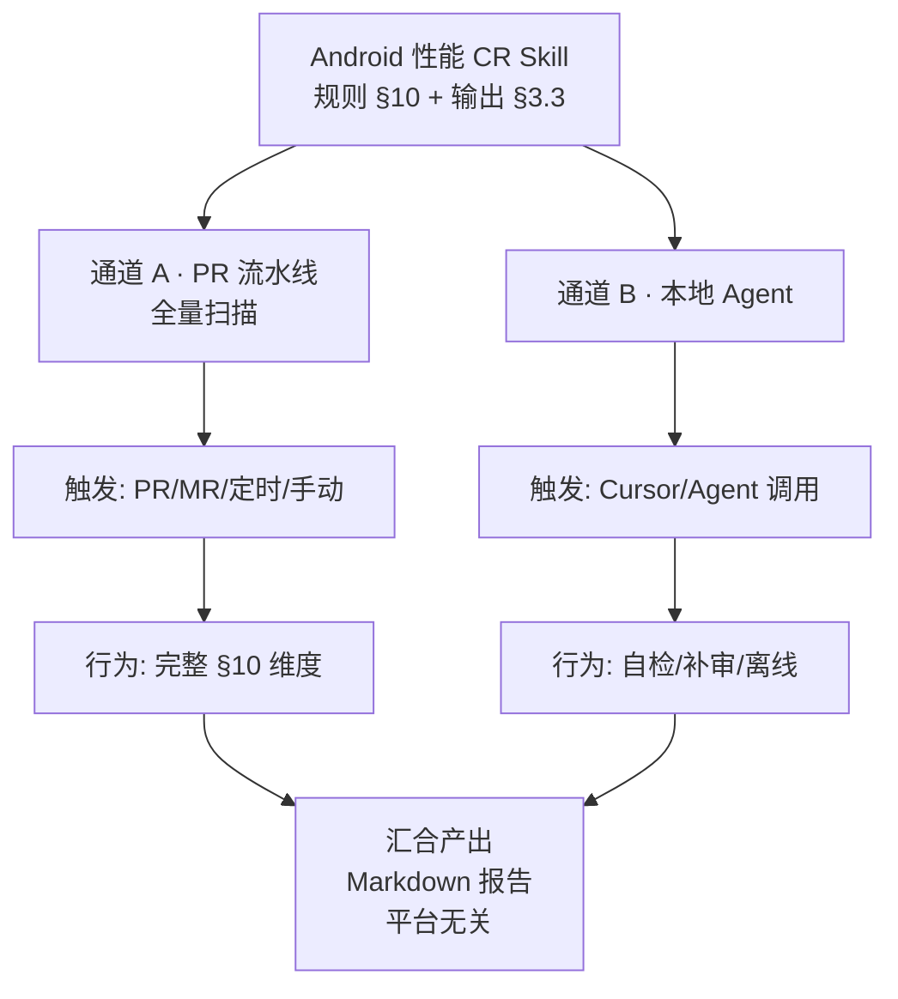
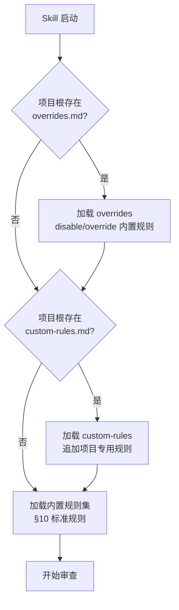
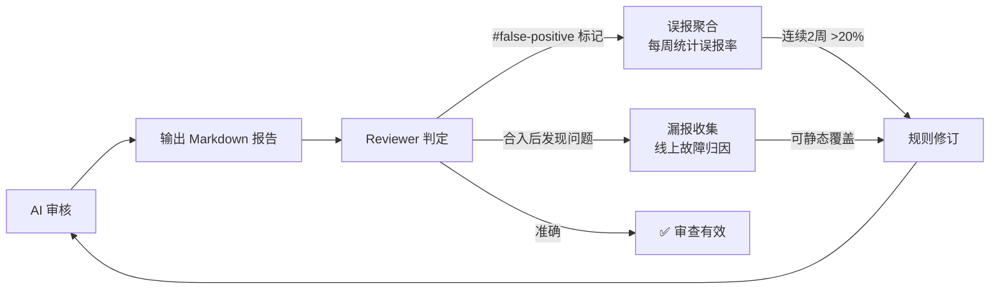
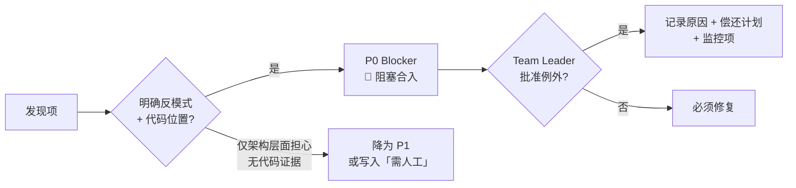
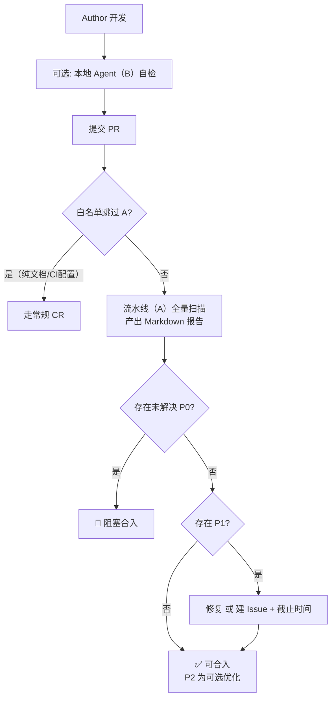
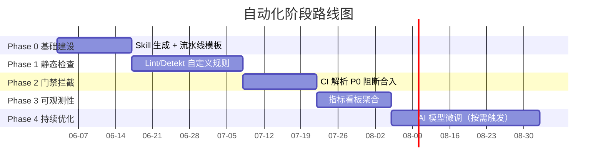

# Android 性能 AI Code Review 技能 PRD

| 属性 | 内容 |
|------|------|
| 文档版本 | v1.3 |
| 创建日期 | 2026-06-03 |
| 状态 | 草案 |
| 适用范围 | Android 客户端（Java/Kotlin），含 View 体系与 Jetpack Compose |
| 关联产物 | Cursor Agent Skill（`android-performance-cr`，待创建） |

---

## 1. 背景与目标

### 1.1 背景

Android 应用在启动速度、流畅度、内存、电量与稳定性上的体验，高度依赖日常迭代中的代码质量。性能问题往往在合入后才发现，修复成本高。需要在 **Code Review（CR）** 阶段建立可执行、可度量的检查规则，并封装为 **AI Agent Skill**，供 Cursor/同类 AI Code Reviewer 在 PR 审查时稳定调用，将性能风险前置拦截。

### 1.2 目标

- 定义一套 **结构化、可勾选** 的 Android 性能 CR 规则，供 AI Code Review 使用。

- 规则按 **严重等级** 与 **检查维度** 分类，便于培训、统计与自动化扩展（Lint、静态分析、AI Review）。

- 每条规则包含：**检查项、反例、正例、判定标准、参考工具**（见第 10 章）。

- 明确 **双触发通道**（PR 流水线全量扫描/本地 Agent）、**平台无关的 Markdown 输出**、与 CR 流程衔接，使审查结果可复现、可聚合。

### 1.3 非目标

- 不替代完整的性能测试（Benchmark、Monkey、线上 APM）。

- 不覆盖 iOS/服务端性能规范。

- 不在本阶段实现 Lint 规则代码或 CI 流水线（仅定义规则与路线图）。

### 1.4 成功指标

| 指标 | 目标 | 度量方式 |
|------|------|----------|
| CR 覆盖率 | 性能相关 PR 中 ≥ 80% 附带审查 Markdown 产物 | 流水线制品或 PR 附件中存在 `android-performance-cr-report.md`（或同等内容） |
| 问题前置率 | P0 类（主线程违规、明显泄漏）合入前拦截率较基线提升 | 对比合入前后 30 天同类 Issue/ANR 归因 |
| 审查一致性 | 同一 diff 两次 AI 审查，P0/P1 结论一致率 ≥ 70% | 双跑抽样（Phase 3 上线后） |
| 误报可接受度 | Reviewer 标记「不适用」的 P0 建议占比低于 15% | 评论标签 `#false-positive` 统计 |

---

## 2. 用户与使用场景

### 2.1 角色

| 角色 | 职责 |
|------|------|
| AI Code Reviewer | 挂载本 Skill，按规则逐项审查，输出 Blocker/Should Fix/Nice to Have |
| 提交者（Author） | 在 PR 描述中标注改动类型、性能验证方式（满足 OBS-01） |
| Team Leader | 维护规则版本、裁定争议与 P0 例外 |
| 平台/性能组 | 提供工具链、基线数据、规则迭代与 Lint 映射 |

### 2.2 使用场景

| 场景 | 审查侧重 | Hotfix 说明 |
|------|----------|-------------|
| 功能 PR（UI/网络/存储/后台） | 按 §5 映射勾选对应维度 | 可缩减至「必查维度」，**P0 不得跳过** |
| 重构/架构 PR | 启动链、生命周期、线程模型（§10.2、§10.8、§10.1） | 同上 |
| 依赖升级 PR | 包体、启动、主线程（§10.9、§10.2） | 同上 |
| 仅文案/颜色 | §10.3（若动布局）、§10.9（若新增资源） | 流水线仍全量扫描；本地可按 §6 速查缩减 |

---

## 3. AI Skill 产物定义

本 PRD 的规则清单将落地为 Cursor **Agent Skill**。Skill 是审查时的「操作手册」，不是应用代码。

### 3.1 触发方式（双通道）

审查能力通过 **同一套 Skill + 同一 Markdown 输出**，由两种入口触发；**不绑定** GitLab、GitHub、Cursor 等特定平台的评论或 API 形态。

**双通道关系**



| 通道 | 谁触发 | 扫描范围 | 典型时机 |
|------|--------|----------|----------|
| **A. PR 流水线** | CI/CD 在 PR/MR 打开、更新 push、或合并前门禁 | **全量**：§10 全部维度均执行（不按关键词缩减 checklist） | 合入前强制产出报告；可与 Lint Phase 2 并行 |
| **B. 本地 Agent** | 开发者在 IDE 挂载/ `@` 本 Skill | **默认全量**；Author 可声明仅审 §6 速查维度（须在输出中写明「缩减范围」） | push 前、Reviewer 要求补审、无流水线环境 |

**流水线跳过（需配置白名单）**：仅当 PR 变更文件类型为纯文档、仅 CI 配置、且无 `.kt`/`.java`/相关 `.xml`/`build.gradle` 时，允许跳过 A；须在合并策略中显式配置，不得默认跳过。

**与 B 的关系**：B 不替代 A；本地结论可供 Author 提前修复，**合入门禁以 A 的 Markdown 产物为准**（若组织启用流水线门禁）。

### 3.2 输入

| 输入 | 通道 A（流水线） | 通道 B（本地 Agent） |
|------|------------------|----------------------|
| 代码变更集 | PR/MR 完整 diff（base → head） | `git diff`、未提交改动、或用户 @ 指定文件/目录 |
| 文字说明 | PR 描述正文（纯文本/Markdown 均可） | 用户对话补充、可选本地 `CR\_DESCRIPTION.md` |
| 可选上下文 | Lint 报告、模块 README | 同左 |

### 3.3 输出格式（强制·平台无关）

**唯一交付形态为标准 Markdown 文档**（`.md` 或等价字符串）。禁止依赖某一托管平台的专有字段（如 GitHub Review Comment JSON-only、GitLab Note 扩展字段等）作为唯一载体。

| 约定项 | 说明 |
|--------|------|
| 推荐文件名 | `android-performance-cr-report.md` |
| 编码与结构 | UTF-8；标题层级与下表固定，便于脚本解析 |
| 投递方式（任选，由团队自行接入） | 流水线制品库、PR 附件、粘贴进 PR 描述、IM、Wiki；**内容格式不变** |
| 元数据 | 文首 YAML front matter **可选**；无 front matter 时须保留下文「摘要」列表项 |

AI 审查结果须使用以下结构：

```markdown

## Android 性能 CR 摘要

- **改动类型**：（Author 声明 + AI 推断）

- **触发通道**：pipeline | local-agent

- **AI 模型/版本**：（如 GPT-4o-2024-08-06 / Claude-3.5-Sonnet；由调用方注入，用于一致性复盘）

- **扫描范围**：full（§10 全量）| reduced（注明依据 §6 条目）

- **已查维度**：10.1, 10.3, …

- **审查耗时**：（秒；如超时则标注 partial 并注明原因）

- **合入建议**：通过/修复后合入/阻塞（存在未解决 P0）

### 发现项

| 规则 ID | 等级 | 文件:行 | 说明 | 建议 |
|---------|------|---------|------|------|
| MT-01 | P0 | FooActivity.kt:42 | 主线程同步读 SP | 改为 apply/DataStore |

### 未覆盖/需人工

- （如：仅改 ProGuard 规则，无法静态判断启动影响）

### 验证建议（OBS-01）

- （若 PR 未说明，AI 应提示 Author 补充）

```

在 PR 讨论中引用单条发现时，仍建议使用行内格式：`\[MT-01|P0] …`（纯 Markdown 文本，非平台 API）。

### 3.4 Skill 文件结构（待实现）

| 路径 | 内容 |
|------|------|
| `android-performance-cr/SKILL.md` | 双通道说明、§3.3 输出模板、§6 映射表、P0 优先；**默认面向通道 B** |
| 本 PRD §10 | 规则权威来源；Skill/流水线均引用同一规则集 |

### 3.5 规则加载机制：内置规则 + 外置规则

Skill 采用 **双层规则模型**，兼顾通用性与项目定制：

**内置规则**：Skill 内部预置本 PRD §10 的全部规则（约 40+ 条），开箱即用。

**外置规则**：项目可通过在仓库根路径放置规则文件，在审查时自动合并。Skill 启动时按以下**发现顺序**加载（后加载的同 ID 规则覆盖内置）：

| 优先级 | 路径 | 说明 |
|--------|------|------|
| 1（最高） | `<项目根>/.android-performance-cr/custom-rules.md` | 项目专用规则，覆盖或补充内置规则 |
| 2 | `<项目根>/.android-performance-cr/overrides.md` | 项目级内置规则覆盖（如调整等级、禁用某规则） |
| 3（默认） | Skill 内置规则集 | §10 标准规则，作为兜底 |



**外置规则文件格式**：与 §10 表格同构（Markdown 表格）；每条规则至少包含 `ID | 等级 | 检查项 | 反例 | 正例 | 判定 | 参考工具`。未指定 ID 的规则将被跳过。

**overrides.md 格式**：

```markdown
| 操作 | 规则 ID | 新等级 | 说明 |
|------|--------|--------|------|
| disable | MEM-03 | — | 项目使用统一图片加载框架，自动采样 |
| override | ST-01 | P1 | 启动 SDK 初始化已在基线中计量，P0 过严 |
| add | CUSTOM-01 | P0 | （新增规则，须包含完整七列） |
```

**覆盖行为**：
- `disable`：本次审查忽略该规则，不在报告中出现。
- `override`：改变内置规则等级（P0↔P1↔P2），保留其他属性。
- `add`：追加新规则（须包含完整七列），ID 格式建议 `CUSTOM-NN`。
- **合入门禁仍以通道 A 报告中的 P0 为准**：被 override 降级的 P0 不再阻塞，被 add 或 override 升级的 P0 将阻塞合入。

### 3.6 审查规模与 SLA

**适用范围**：通道 A（流水线全量扫描）。通道 B（本地 Agent）由开发者自行把控。

| 参数 | 建议值 | 说明 |
|------|--------|------|
| 单文件最大行数 | 2000 行 | 超大文件按方法/类边界分段审查，每段独立产出发现项 |
| 单次审查最大文件数 | 80 个 | 超过时按 §6.1 路径启发式排列优先级，优先审查高敏感文件 |
| 单次审查超时 | 300 秒（5 分钟） | 超时后须在报告中标注 `partial` + 未完成的维度清单 |
| 建议并发审查数 | ≤ 3 个 PR 同时 | 避免 API 速率限制导致审查排队 |

**超时降级策略**：
1. 超时触发 → 立即产出已完成的 P0 发现项。
2. 报告中标注 `partial` + 列明遗漏维度。
3. 可选：流水线自动重跑一次（最多 1 次重试），若仍超时则人工介入。
4. 超时发现项仍有效；Reviewer 需额外关注「未覆盖」部分。

**大 PR 处理**：变更文件 > 50 个时，进入 **大文件模式**：
- 按 §6.1 路径启发式智能分组，优先审改动的核心文件（如 Application、Activity、协程密集代码）。
- 非核心文件（纯资源、测试文件）降低审查深度（P0 仍全覆盖，P1/P2 抽样）。
- 报告标注 `large-pr`，并列出跳过的文件清单。

### 3.7 质量保障与反馈机制

**目标**：确保 AI 审查结果持续可靠，建立「发现 → 反馈 → 修订」闭环。



**3.7.1 误报反馈**

**3.7.1 误报反馈**
- Reviewer 可在 PR 讨论中标记 `#false-positive`（后跟规则 ID，如 `#false-positive MT-03`）。
- 每周自动聚合：统计各规则 ID 的误报率。
- 误报率阈值：单规则误报率 **连续 2 周 > 20%** → 触发规则修订（调整反例/正例描述或降级）。
- 反馈格式建议（纯文本，平台无关）：

```markdown
### 误报反馈
- 规则 ID：MT-03
- 代码位置：Utils.kt:156
- 误报原因：该 JSON 大小 < 10KB，主线程解析可接受
- 建议：增加数据量级判定条件
```

**3.7.2 漏报收集**
- 合入后发现的性能问题（线上 ANR、卡顿归因、内存泄漏）需回注规则集。
- 流程：性能组每周审查线上新增性能故障 → 判断是否可用静态规则覆盖 → 归类到 §10 对应维度 → 增补规则或修改判定条件。

**3.7.3 审查校准**
- 频率：每两周一次。
- 方式：抽取 5–10 个已合入 PR，AI 重审 + Reviewer 独立审查，对比差异。
- 输出：校准报告（差异统计、规则修订建议）。
- 目标：P0/P1 一致率持续提升，校准差异逐次收敛。

**3.7.4 审查一致性度量**
- Phase 3 上线后，对同一 diff 双跑（同模型两次调用），统计 P0/P1 结论完全一致的比例。
- 门槛：≥ 70%（§1.4 成功指标）。
- 若低于门槛：排查 prompt 歧义、规则描述模糊项、模型温度参数。

---


## 4. 规则分级

| 等级 | 代号 | 含义 | CR 行为 |
|------|------|------|---------|
| P0 | Blocker | 高概率导致 ANR、崩溃、严重卡顿或内存失控 | **必须修复**方可合入 |
| P1 | Should Fix | 明显性能劣化或坏味道，短期可接受需跟进 | 本次修复或建 Issue 并约定时间 |
| P2 | Nice to Have | 优化建议、可维护性 | 建议采纳，不阻塞合入 |



**AI 判定原则**：有明确反模式匹配且可指向代码位置 → 按表定级；仅架构层面「可能」变慢且无代码证据 → 降为 P1 或写入「需人工」。

---

## 5. CR 流程



### 5.1 AI Code Reviewer 审查步骤

1. 解析 diff，用 §6 表确定 **必查维度**（Compose 与 View 共用维度编号，Compose 专项见 UI-05、MEM-02 中 Compose API）。

2. 在该维度内 **先 P0 后 P1**，每条发现绑定 `规则 ID` + 文件行号。

3. 无法从静态 diff 判断的项写入「未覆盖/需人工」，不得臆造 P0。

4. 例外合入 P0：须 Team Leader 批准，PR 记录原因、偿还计划、监控项。

5. **审查规模检测**：变更文件 > 50 个时自动进入大文件模式（§3.6），核心文件全量审、非核心缩减。

6. **超时保护**：通道 A 超时（§3.6）时优先产出 P0 发现项，标注 `partial` 及遗漏维度。

7. **报告完整性检查**：产出前确认 `合入建议` 字段与 P0 状态一致；若标注 `partial` 则必须列明遗漏维度。

### 5.2 争议处理

- 规则解释以本文档 §10 为准；歧义由性能组 + Team Leader 裁定。

- 业务强需求无法满足时：降级为 P1 + Issue + 线上监控。

- AI 与人工结论冲突：以人工为准，并通过误报反馈机制（§3.7.1）回注修订。

- 争议裁定结果须记录：规则 ID、裁定理由、最终等级、裁定人、日期；供 §3.7.3 校准参考。

---

## 6. 改动类型 → 规则维度速查

按改动类型勾选 **§10** 中对应小节。

| 改动类型 | 必查章节（§10） | 通道 A | 通道 B |
|----------|-----------------|--------|--------|
| 新页面/列表/动画 | 10.1 主线程、10.3 UI、10.4 内存 | 全量含上表 + 其余维度 | 可仅审上表（须在报告中标注 reduced） |
| Application/启动/SDK | 10.2 启动、10.9 包体与依赖 | 全量 | 可缩减 |
| 接口/数据层 | 10.1、10.5 网络、10.6 磁盘 | 全量 | 可缩减 |
| 后台/推送/定时 | 10.7 后台与电量、10.8 线程与协程 | 全量 | 可缩减 |
| 仅文案/颜色 | 10.3（若涉及布局）、10.9（若新增资源） | 全量 | 可仅审上表 |
| Compose 新屏 | 10.1、10.3（含 UI-05）、10.4、10.8 | 全量 | 可缩减 |

**合入最低要求**：通道 A 报告内 **零未解决 P0**（全量扫描下仍按规则 ID 上报，无发现则表为空）；OBS-01 在性能敏感改动时必填。

### 6.1 路径启发式（供 AI 辅助映射）

| 路径/符号特征 | 建议纳入维度 |
|-----------------|--------------|
| `Application`、`ContentProvider`、`Startup` | 10.2 |
| `Activity`/`Fragment`/`Composable` + `onCreate`/`LaunchedEffect` | 10.1、10.2 |
| `RecyclerView`、`Adapter`、`LazyColumn` | 10.3、10.4 |
| `OkHttp`、`Retrofit`、`suspend` 网络层 | 10.5、10.1 |
| `SharedPreferences`、`DataStore`、`Room` | 10.6、10.1 |
| `WorkManager`、`Service`、`AlarmManager` | 10.7 |
| `Dispatchers`、`CoroutineScope`、`Flow` | 10.8 |
| `build.gradle` / `build.gradle.kts`（新依赖、SDK 版本变更） | 10.9、10.2 |
| `proguard-rules.pro` / R8 配置变更 | 10.9（包体与启动效果需补充验证） |
| JNI / `.cpp` / `.c` / `System.loadLibrary` | 10.1（JNI 调用频率）、10.4（Native 内存）、10.8（线程挂载） |
| `WebView` / `WebViewClient` / `@JavascriptInterface` | 10.11 |
| `minSdk` / `targetSdk` / `compileSdk` 变更 | 10.7（后台限制）、10.9（包体策略） |

### 6.2 影响半径启发式（供 AI 审查时扩展维度）

AI 审查时遇到以下「高影响节点」改动，应联动扩展审查维度（即使改动区不在该文件自身）：

| 改动点 | 影响半径 | 连带审查维度 |
|--------|----------|-------------|
| `Application.onCreate` | 全链路启动 | 10.2（全文）、10.1（主线程路径）、10.4（生命周期持有） |
| 核心网络模块（API 基础类、拦截器） | 所有网络调用路径 | 10.5（全量）、10.1（回调线程） |
| `ViewModel` / `Presenter` 基类 | 所有子类页面 | 10.4（泄漏）、10.8（协程 Scope） |
| 自定义 View 基类 | 所有实例 | 10.3（onDraw 分配、布局层级） |
| `build.gradle` 依赖变更 | 全模块 | 10.9、10.2（启动链路） |
| `AndroidManifest.xml` 新增组件 | 对应组件链路 | 10.7（Service/BroadcastReceiver）、10.2（Provider） |

---

## 7. 工具与自动化路线图

### 7.1 推荐工具

| 场景 | 工具 |
|------|------|
| 主线程 IO/泄漏 | StrictMode、LeakCanary |
| 卡顿/启动 | Android Studio Profiler、Perfetto、Systrace |
| 内存 | Memory Profiler、Heap Dump |
| 电量 | Battery Historian |
| 静态检查 | Android Lint、Detekt 自定义规则 |
| Compose | Layout Inspector（重组）、Macrobenchmark（可选） |

### 7.2 自动化阶段

| 阶段 | 内容 | 对应规则示例 | 完成标准 |
|------|------|----------------|----------|
| Phase 0 | 生成 Skill（通道 B），共用 §3.3 Markdown | 全文 | 通道 B 可本地产出 Markdown |
| Phase 1 | Lint/Detekt 自定义 | MT-01、MT-02、MEM-02 部分模式 | ≥ 80% P0 规则存在对应 Lint 检查 |
| Phase 2 | CI 解析 Markdown 中 P0 行阻断合入 | 与 §3.3 表格列 `等级` = P0 且未关闭 | ≥ 3 个 PR 成功触发阻断/放行 |
| Phase 3 | 指标看板聚合规则 ID | 从制品 `android-performance-cr-report.md` 抽取 | 看板展示 CR 覆盖率、P0 拦截率、误报率趋势 |
| Phase 4（预留） | AI 模型微调/精调 | P0 误报率高于阈值（§3.7.1）的规则 | 误报率连续 4 周 < 15% |



**阶段间升级条件**：前阶段稳定运行 ≥ 2 周 + 完成标准全部达标 → 开启下一阶段。**回滚策略**：若 Phase 2 门禁导致 ≥ 3 个 PR 被误拦且无法在 30 分钟内解除，临时降级为「仅警告不阻断」，待规则修复后恢复。

### 7.3 流水线与本地集成（平台无关）

| 能力 | 要求 |
|------|------|
| 审查产物 | **仅** Markdown；各平台自行决定「制品归档/PR 描述粘贴/机器人转发」 |
| 通道 A | 流水线 输入 diff + 描述，输出固定文件名；**全量 §10** |
| 通道 B | `skills/.../SKILL.md`；开发者本地生成同格式 Markdown |
| PR 模板（可选） | 建议增加「改动类型」「验证方式」纯文本字段，对齐 OBS-01；**非强制依赖任一托管商** |
| 门禁 | Phase 2 起由脚本解析 Markdown 判定 P0，不解析平台专有 Review API |
| 与通用 CR AI Skill | 本 Skill **专注性能**；风格/安全由其他 Skill 输出独立 `.md`，可并列提交 |

---

## 8. 附录

### 8.1 术语

| 术语 | 说明 |
|------|------|
| TTID | Time To Initial Display，首帧显示 |
| TTFD | Time To Full Display，首屏内容完整 |
| ANR | Application Not Responding |
| Jank | 掉帧、卡顿 |

### 8.2 业务自定义指标（待填写）

| 业务线 | 冷启动 P50 目标 | 列表滑动 FPS | 其他 |
|--------|----------------|--------------|------|
| \_\_\_ | \_\_\_ ms | ≥ \_\_\_ | \_\_\_ |

### 8.3 修订记录

| 版本 | 日期 | 修订人 | 说明 |
|------|------|--------|------|
| v1.0 | 2026-06-03 | — | 初版：10 维度、40+ 检查项 |
| v1.1 | 2026-06-03 | — | 补充 Skill 定义、流程图、章节引用修正、成功指标度量、输出模板、路径映射 |
| v1.2 | 2026-06-03 | — | 平台无关 Markdown 输出；双触发（流水线全量/本地 Agent） |
| v1.3 | 2026-06-03 | — | 补充遗漏规则、外部规则机制、SLA、质量反馈闭环、影响半径、已知限制 |

### 8.4 已知限制

以下问题类型属于静态 diff 审查的 **固有盲区**，AI Code Reviewer 在未配备运行时工具时无法准确检测。Skill 在对应场景下应输出「需人工」或引用对应工具建议，不作为 P0 报告。

| 限制类型 | 说明 | 建议兜底方式 |
|----------|------|-------------|
| Native 内存分配 | JNI 层 `malloc`/`new` 无 GC 管理，无法从 Java/Kotlin 静态代码追踪 | Perfetto Heap Profile、MAT Native 堆分析 |
| JNI 调用耗时 | `native` 方法内部逻辑不可见，无法评估是否有阻塞操作 | Systrace 自定义 Trace Section、Perfetto |
| 反射调用 | 运行时反射的类加载、方法调用开销无法静态预判 | R8 反射规则审查（若可获取） |
| 动态代理 / AOP | 编译期/运行时字节码插桩引入的额外开销不可见 | Gradle 编译扫描、Transform 列表审查 |
| 运行时配置变化 | `onConfigurationChanged` 引起的重建/重组频率依赖设备环境 | 旋转/折叠模拟测试、Compose Layout Inspector |
| 第三方 SDK 内部行为 | SDK 闭源 jar/aar 内部实现无法审查 | SDK 性能文档、接入前 benchmark 基线 |
| 线程调度实际分布 | 协程/线程池的任务调度受设备核心数、负载、温控影响 | Systrace 实际运行轨迹 |
| 硬件相关性能 | GPU 渲染瓶颈、存储介质差异（eMMC vs UFS）、发热降频 | GPU 渲染分析、Battery Historian |
| ProGuard/R8 实际效果 | 保留规则不当导致的包体膨胀需运行时验证 | APK Analyzer 比对、包体对比 |

**处理原则**：AI 遇到上述场景时，不应臆造发现项；应在报告中「未覆盖/需人工」中注明受限类型 + 建议的验证工具，引导 Reviewer 关注。

---

## 9. 开放问题与决策记录

| # | 问题 | 当前建议 | 状态 |
|---|------|----------|------|
| 1 | 审查结果是否绑定某一 PR 平台？ | **否**：仅 Markdown；平台只负责存储/展示/门禁解析 | 已决（v1.2） |
| 2 | Compose 与 View 是否两套 checklist？ | **否**：共用 §10 维度，Compose 增加 UI-05 等专项规则 | 已决（v1.1） |
| 3 | 各业务线 P50/P99 何时填入 §8.2？ | 性能组牵头一季内填首版，未填前 success 指标仅统计流程类 | 待排期 |
| 4 | 流水线 Job 用何引擎调用 Skill？ | 与 Cursor Agent CLI/自建 prompt 包对齐即可；输入输出遵守 §3.2–3.3 | 待实现 |
| 5 | 多模块/多进程项目是否拆分审查报告？ | 建议单份报告涵盖全项目；若模块独立上线，可按模块生成独立报告 | 讨论中 |
| 6 | 外置规则的热更新机制？ | 暂定仓库文件变更即生效；后续可考虑规则中心下发 | 待排期 |
| 7 | 审查耗时/成本的监控？ | Phase 3 看板纳入；门禁阶段加入 API 调用量预警 | 待实现 |

---


## 10. 规则清单（按维度）

> 说明：**IO-01** 与 **MT-01** 主线程磁盘 IO 重叠；IO-01 强调存储介质与体量，命中时任一报告即可。**参考工具** 列供 AI 在建议中引用，非每条都必须跑工具。

### 10.1 主线程与 ANR（P0 高发区）

| ID | 等级 | 检查项 | 反例 | 正例 | 判定 | 参考工具 |
|----|------|--------|------|------|------|----------|
| MT-01 | P0 | UI 线程禁止同步磁盘 IO | `File.readText()`、`SharedPreferences.commit()` 在 Activity 中同步调用 | `Dispatchers.IO`、`commit()` 改 `apply()`、DataStore 异步 API | 主线程栈出现阻塞 IO | StrictMode、Systrace |
| MT-02 | P0 | UI 线程禁止同步网络 | `OkHttp.execute()`、`HttpURLConnection` 在主线程 | 协程 + IO Dispatcher、Retrofit suspend、Callback 切线程 | 网络调用在主线程 | StrictMode、Lint |
| MT-03 | P0 | 禁止主线程大计算 | 主线程解析超大 JSON、图片编解码、复杂正则 | 后台解析后 `withContext(Main)` 更新 UI | 单次主线程占用明显可感知 | Systrace |
| MT-04 | P0 | BroadcastReceiver 内长任务 | `onReceive` 中直接做网络/数据库 | `goAsync()` + 后台线程，或转 WorkManager | 10s 内无法完成 | — |
| MT-05 | P1 | 避免主线程锁等待 | 主线程 `synchronized` 等待后台持有的锁 | 缩小锁粒度、无锁结构、主线程不持锁等待 | Systrace 见主线程阻塞 | Systrace |
| MT-06 | P0 | WebView/JS Bridge 禁止主线程重操作 | `webView.loadUrl()` 后紧跟同步等待、`evaluateJavascript` 在主线程阻塞等待结果 | 异步回调处理、WebView 初始化异步完成后再 attach | 主线程调用 WebView API 且有同步等待语义 | Systrace |
| MT-07 | P1 | 主线程避免调用系统服务重操作 | `getSystemService` 后同步执行重量查询、`PackageManager` 主线程查询 | 后台线程获取后切回主线程、缓存系统服务引用 | 主线程调用系统服务耗时 > 5ms | Systrace |

---

### 10.2 启动与初始化

| ID | 等级 | 检查项 | 反例 | 正例 | 判定 | 参考工具 |
|----|------|--------|------|------|------|----------|
| ST-01 | P0 | Application 中禁止非必要同步重初始化 | `onCreate` 内初始化所有 SDK、读大配置 | 延迟初始化、按需加载、Startup 库编排 | 冷启动主线程耗时骤增 | Macrobenchmark、Systrace |
| ST-02 | P1 | ContentProvider 滥用初始化 | 多个 SDK 通过 Provider 自动拉起 | 合并 Provider、懒加载 | 启动前多余进程工作 | App Startup 指南 |
| ST-03 | P1 | 首屏避免阻塞绘制 | 首 Activity `onCreate` 同步请求接口再 `setContent` | 骨架屏 + 异步加载、预请求与启动并行 | TTFD 变差 | Profiler |
| ST-04 | P2 | 启动任务可度量 | 无埋点 | 分阶段打点（Application、首帧、可交互） | 无法回归对比 | 内部埋点规范 |
| ST-05 | P1 | ContentProvider.onCreate 禁止同步重初始化 | `onCreate` 内同步初始化大型 SDK、读文件、网络预热 | 延迟到首次调用、标记 init 状态异步完成 | 冷启动 provider 耗时 > 50ms | Systrace |
| ST-06 | P1 | 避免 Application 静态字段初始化重对象 | `companion object` / `static` 中 `lazy` 包裹重量对象但首次访问仍在主线程 | 预加载到后台线程、或主动在 IdleHandler 中触发 | 首次使用卡顿明显 | Systrace |

---

### 10.3 UI 渲染与流畅度

| ID | 等级 | 检查项 | 反例 | 正例 | 判定 | 参考工具 |
|----|------|--------|------|------|------|----------|
| UI-01 | P0 | 列表必须使用 ViewHolder/等价复用 | ListView 不复用、`RecyclerView` 每次 `new View` | 标准 Adapter + ViewHolder/`RecyclerView` 复用 | 滑动掉帧、内存涨 | Layout Inspector |
| UI-02 | P1 | 减少布局层级与过度绘制 | 深层 LinearLayout 嵌套、多层背景 | ConstraintLayout、合并背景 | Layout Inspector 层级 > 10 | Layout Inspector |
| UI-03 | P1 | 自定义 View onDraw 禁止分配对象 | `onDraw` 里 `new Paint()`、new 集合 | 成员变量复用、对象池 | 滑动时 GC 频繁 | Systrace |
| UI-04 | P1 | 避免频繁 invalidate/requestLayout | 动画每帧全屏 `invalidate()` | 局部刷新、硬件层合理使用 | Systrace 见 excessive draw | Systrace |
| UI-05 | P1 | Compose：缩小重组范围 | 大 Composable 无 stable 参数导致全树重组 | `remember`、`derivedStateOf`、拆分子 Composable、`@Stable` | 重组范围过大 | Layout Inspector |
| UI-06 | P2 | 动画与硬件加速 | 不当 `clipChildren`、软件层动画 | 按官方建议启用硬件加速 | GPU 过载或掉帧 | GPU 渲染分析 |
| UI-07 | P1 | Compose：remember 须带稳定 key | `remember { heavyCompute() }` 无 key，重组时重复计算 | `remember(key) { heavyCompute(key) }`、`derivedStateOf` 派生 | 重组触发重复重计算 | Layout Inspector |
| UI-08 | P1 | RecyclerView 条目变更动画避免全量刷新 | `notifyDataSetChanged()` 导致全局重绑 | `DiffUtil` + `ListAdapter`、精确 `notifyItemChanged/Inserted/Removed` | 列表更新时掉帧 | Systrace |

---

### 10.4 内存

| ID | 等级 | 检查项 | 反例 | 正例 | 判定 | 参考工具 |
|----|------|--------|------|------|------|----------|
| MEM-01 | P0 | 禁止 Activity/Context 泄漏 | 静态变量持有 Activity、匿名内部类持有外部类 | `WeakReference`、Application Context（仅合适场景）、及时解绑 | LeakCanary/MAT 可复现 | LeakCanary |
| MEM-02 | P0 | 监听/订阅/协程必须随生命周期取消 | 未 `removeListener`、GlobalScope 启动 UI 相关协程 | `lifecycleScope`、`viewModelScope`、`DisposableEffect` | 退出页面后仍回调 | LeakCanary、Lint |
| MEM-03 | P1 | 大图按采样加载 | 原图解码进 ImageView | `inSampleSize`、Glide/Coil 尺寸与占位 | OOM 或内存峰值异常 | Memory Profiler |
| MEM-04 | P1 | 缓存必须有界 | 无界 `HashMap` 做图片/接口缓存 | LruCache、带容量与过期策略 | 长时间使用后内存单调涨 | Memory Profiler |
| MEM-05 | P1 | 及时释放大对象与 Native 资源 | Bitmap 长期持有、Cursor 未 close | try-finally/use、加载库规范 | 内存 Profiler 残留 | Memory Profiler |
| MEM-06 | P0 | 禁止 Handler / 匿名内部类持有 Activity | `Handler(Looper.getMainLooper()) { ... }` 匿名对象未移除、内部类隐式持有 | 静态内部类 + `WeakReference`、`LifecycleObserver` 自动清理 | 退出 Activity 后仍可回调 | LeakCanary |
| MEM-07 | P1 | WebView 建议独立进程 | WebView 与主进程共用，内核占用的 Native 内存无法释放 | `android:process=":webview"`、退出时 `destroy()` | WebView 内存持续增长 | Memory Profiler |

---

### 10.5 网络

| ID | 等级 | 检查项 | 反例 | 正例 | 判定 | 参考工具 |
|----|------|--------|------|------|------|----------|
| NET-01 | P1 | 避免重复请求与惊群 | 列表每次 bind 都请求同一接口 | 请求去重、合并、缓存 | 流量与耗电异常 | 网络 Profiler |
| NET-02 | P1 | 响应体与解析可控 | 一次拉取超大列表无分页 | 分页、字段裁剪、Protobuf 等 | 解析阻塞后台线程过久 | — |
| NET-03 | P2 | 弱网与超时策略 | 无超时、无限重试 | 退避重试、降级 UI | 用户长时间白屏 | Network Profiler |
| NET-04 | P2 | 连接复用与协议 | 每次 new OkHttpClient | 单例 Client、HTTP/2 | 连接建立开销大 | Network Profiler |
| NET-05 | P1 | 图片加载必须有磁盘缓存 | 每次加载都从网络获取（如 Glide `diskCacheStrategy(NONE)` 用于非临时场景） | 磁盘缓存 + 内存缓存策略、预加载关键图片 | 重复流量与频繁 bitmap 解码 | — |
| NET-06 | P2 | 计量网络检测与流量控制 | 移动网络下全量同步、大文件下载不检测网络状态 | `ConnectivityManager.isActiveNetworkMetered`、Wi-Fi 下批量 | 用户流量超额 | — |

---


### 10.6 磁盘与 I/O

| ID | 等级 | 检查项 | 反例 | 正例 | 判定 | 参考工具 |
|----|------|--------|------|------|------|----------|
| IO-01 | P0 | 主线程禁止同步读大 SP/文件 | `getSharedPreferences().getString` 循环读大 JSON | DataStore、MMKV（评估后）、后台读 | 同 MT-01，强调大体量 | StrictMode |
| IO-02 | P1 | 数据库批量与索引 | 循环单条 insert、无索引查询 | 事务批量、合理索引 | 后台任务耗时过长 | Android Studio Database Inspector |
| IO-03 | P1 | 日志与埋点异步 | 主线程同步写大日志文件 | 异步队列、采样 | 磁盘 IO 影响流畅度 | — |
| IO-04 | P2 | 避免频繁小文件读写 | 每次操作写完整文件 | 批量、追加、合适存储介质 | I/O 次数过多 | — |
| IO-05 | P1 | SharedPreferences 避免同步 commit | `editor.commit()` 同步等待写入完成 | `editor.apply()` 异步写、迁移至 DataStore | 主线程调用 commit 阻塞 ANR 风险 | StrictMode |

---

### 10.7 后台、电量与系统合规

| ID | 等级 | 检查项 | 反例 | 正例 | 判定 | 参考工具 |
|----|------|--------|------|------|------|----------|
| BG-01 | P0 | 后台任务使用合规 API | 滥用隐式广播、常驻无通知服务 | WorkManager、前台服务合规类型 | 系统杀进程或政策风险 | 官方后台限制文档 |
| BG-02 | P1 | WakeLock/定位/传感器及时释放 | 长时间持有 PARTIAL\_WAKE\_LOCK | 最小权限、用完 release | Battery Historian 异常 | Battery Historian |
| BG-03 | P1 | 精确定时与轮询 | 高频 `AlarmManager`、忙轮询 | 批量、JobScheduler 约束 | 待机耗电高 | Battery Historian |
| BG-04 | P2 | 推送与拉取策略 | 无条件全量拉取 | 增量、合并、Doze 兼容 | 后台流量大 | — |
| BG-05 | P0 | Android 14+ 前台服务须声明类型 | `startForeground` 未在 manifest 声明 `foregroundServiceType` | 据用途声明 `dataSync` / `location` / `mediaPlayback` 等 | 系统拒绝启动服务甚至崩溃 | 官方前台服务文档 |
| BG-06 | P1 | 精确闹钟权限适配（Android 12+） | `setExactAlarm` 无权限检查 | `canScheduleExactAlarms()` 前置检查 + 降级策略 | 闹钟静默失败 | 官方 SCHEDULE_EXACT_ALARM 文档 |

---

### 10.8 线程与协程

| ID | 等级 | 检查项 | 反例 | 正例 | 判定 | 参考工具 |
|----|------|--------|------|------|------|----------|
| TH-01 | P1 | Dispatcher 使用正确 | IO 任务用 `Default`、阻塞 Main | IO → `Dispatchers.IO`，计算 → `Default` | 线程池饥饿或阻塞 | Lint（协程） |
| TH-02 | P1 | 线程池可配置、可命名 | 随处 `Executors.newCachedThreadPool()` | 统一线程池、有限队列 | 线程数爆炸 | Systrace |
| TH-03 | P1 | Flow 背压与 collect 上下文 | 热 Flow 无缓冲导致丢事件或阻塞 | `buffer`、`shareIn`、在合适 scope collect | 异常或卡顿 | — |
| TH-04 | P2 | 避免过度并行 | 小任务也 `async` 大量创建 | 批量、顺序、限制并发度 | 调度开销大于收益 | — |
| TH-05 | P0 | 禁止 `runBlocking` 在主线程或任意可能阻塞主线程的路径 | `runBlocking { delay(1000) }`、`runBlocking` 包裹网络请求 | `CoroutineScope.launch` + 挂起、`withContext` | 主线程阻塞，直接导致 ANR | Lint（协程） |
| TH-06 | P1 | 结构化并发：Scope 必须有生命周期归属 | `CoroutineScope(Job())` 无 cancel 管理、随意创建无归属 Scope | `lifecycleScope` / `viewModelScope` / `rememberCoroutineScope` | 泄漏或生命周期异常回调 | Lint（协程） |

---

### 10.9 APK、资源与依赖

| ID | 等级 | 检查项 | 反例 | 正例 | 判定 | 参考工具 |
|----|------|--------|------|------|------|----------|
| PKG-01 | P1 | 新增依赖评估包体与启动 | 引入巨型 SDK 无说明 | 按需引入、动态特性、R8 规则检查 | APK 明显增大 | APK Analyzer |
| PKG-02 | P2 | 资源优化 | 未压缩大图、重复 drawable | WebP、Vector、资源混淆 | 包体与内存占用 | APK Analyzer |
| PKG-03 | P2 | ABI 与分包策略 | 全 ABI 打在一个包 | splits/App Bundle | 下载体积大 | Bundle Tool |
| PKG-04 | P1 | R8/ProGuard keep 规则有效性 | 过度 `-keep class ** { *; }` 或缺少保留关键反射类 | 精细化 keep、`-whyareyoukeeping` 分析 | 包体膨胀或运行时崩溃 | APK Analyzer、R8 报告 |
| PKG-05 | P2 | Native 库剥离（strip） | 发布包中包含 `.so` 调试符号 | `strip` + `ndk.abiFilters` 精确控制 ABI | 包体额外增加 10–30% | APK Analyzer |

---

### 10.10 可观测性（CR 流程要求）

| ID | 等级 | 检查项 | 反例 | 正例 | 判定 | 参考工具 |
|----|------|--------|------|------|------|----------|
| OBS-01 | P1 | 性能敏感改动需说明验证方式 | PR 无说明 | 注明 Profiler/场景/对比数据 | Reviewer 无法评估 | — |
| OBS-02 | P2 | 关键路径有埋点 | 无启动、卡顿埋点 | 统一性能埋点规范 | 线上无法回归 | 内部 APM |
| OBS-03 | P1 | 性能敏感改动须关联线上监控 | 新增功能无 ANR/卡顿/内存指标看板 | 与 APM 团队对齐添加性能面板或已有面板覆盖 | 上线后无数据验证 | 内部 APM |
| OBS-04 | P2 | 调试/测试代码与 release 隔离 | `Stetho`、`LeakCanary`、详细 `Log.d` 未用 `BuildConfig.DEBUG` 守卫 | debug 依赖 `debugImplementation`、日志级别可配置 | 包体膨胀或性能干扰 | — |

---

### 10.11 WebView 性能

| ID | 等级 | 检查项 | 反例 | 正例 | 判定 | 参考工具 |
|----|------|--------|------|------|------|----------|
| WV-01 | P1 | WebView 初始化异步完成 | 首次 `WebView(context)` 在主线程阻塞（内核初始化耗时） | `WebView.startWebView()` 提前预热（Application）、懒加载 attach | 冷启动明显延迟 | Systrace |
| WV-02 | P1 | JS Bridge 调用避免频繁序列化 | 每次 JS 回调传递大 JSON、高频跨语言调用 | 批量传输、核心数据优先、避免非必要 Bridge 调用 | Bridge 调用频率 > 10/s | Systrace 自定义 Trace |
| WV-03 | P1 | WebView 页面正确销毁 | 未调 `destroy()` 或 Activity `onDestroy` 中遗漏 | 独立进程 WebView 主动 remove + destroy，或 onDestroy 中完整清理 | 页面退出后 Native 内存未降 | Memory Profiler |
| WV-04 | P2 | 离线缓存策略 | WebView 每次加载都走网络 | `WebViewClient.shouldInterceptRequest` + 离线包/Service Worker | 重复流量渲染慢 | Network Profiler |

---

## 11. 后续可选规则

以下项可在业务需要时升为 P1/P0，写入 §10 或业务扩展表：

| 主题 | 说明 |
|------|------|
| Baseline Profile | 启动路径是否生成/携带 baseline profile |
| 16 KB 页大小 | Native `.so` 与打包是否满足 Google Play 要求 |
| `RecyclerView` 预取/`DiffUtil` | 大列表是否使用差分与预取 |
| 大图与硬件位图 | `Bitmap.Config`、硬件位图使用是否得当 |
| Compose：`@Stable` / `@Immutable` 注解 | 是否正确标注数据类以跳过不必要的重组 |
| 组件化/模块化性能 | 模块间通信开销、接口设计是否引入额外序列化 |

---

